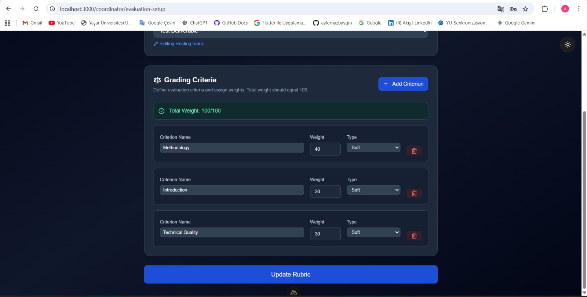
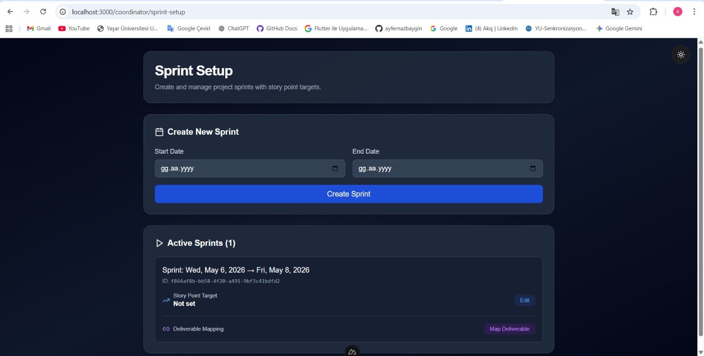
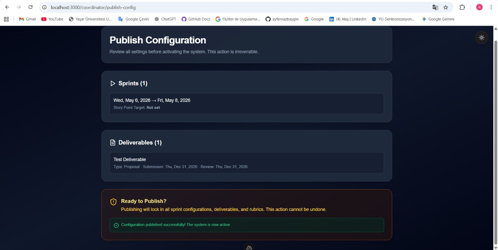
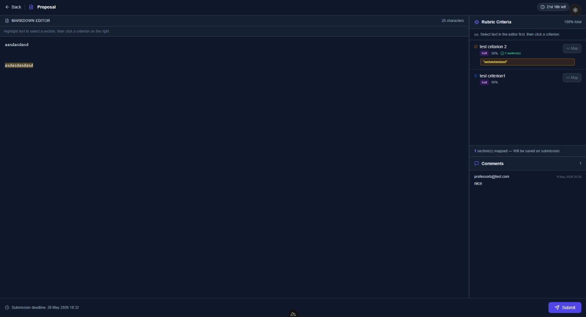
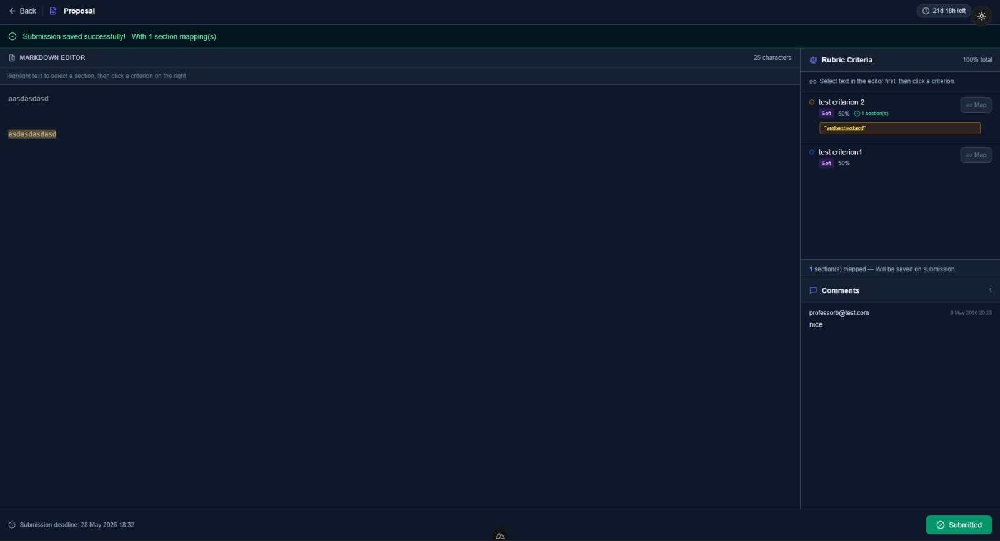
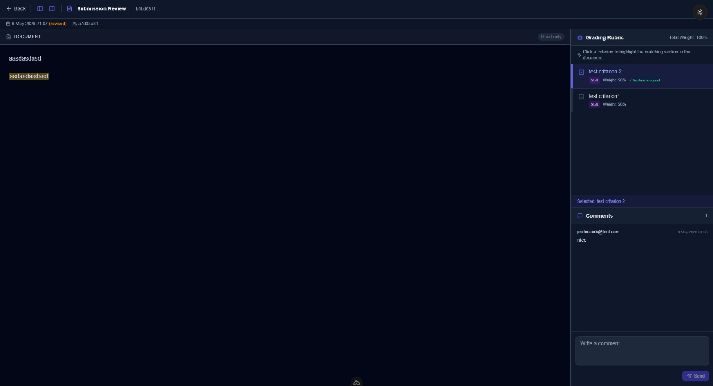
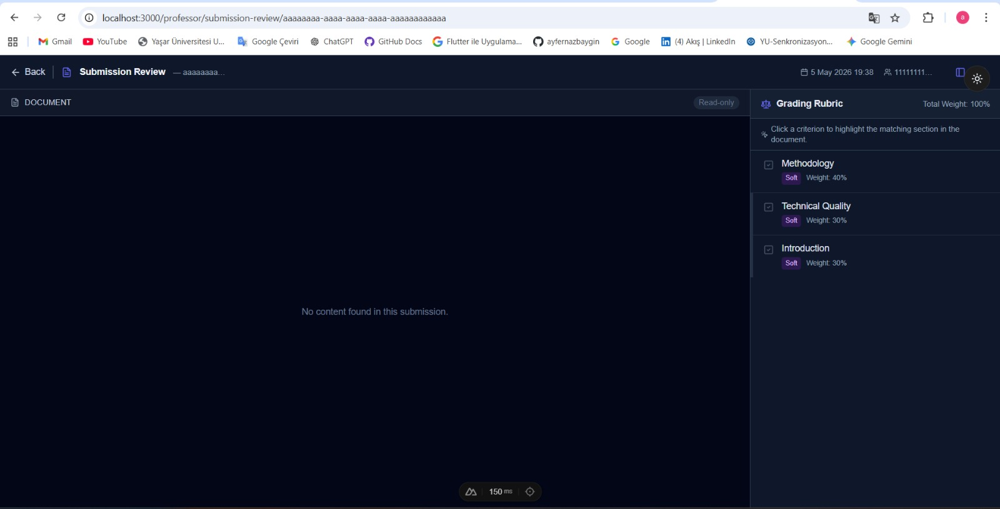
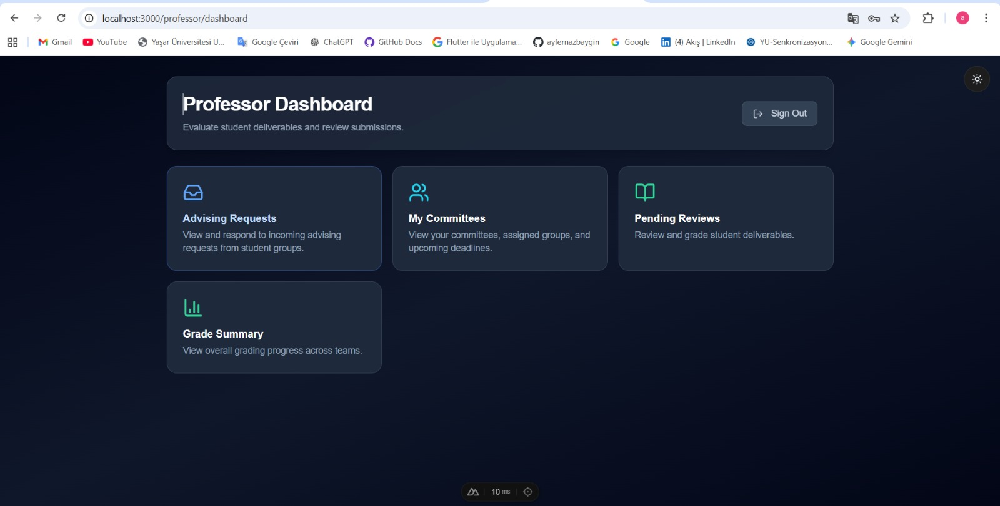
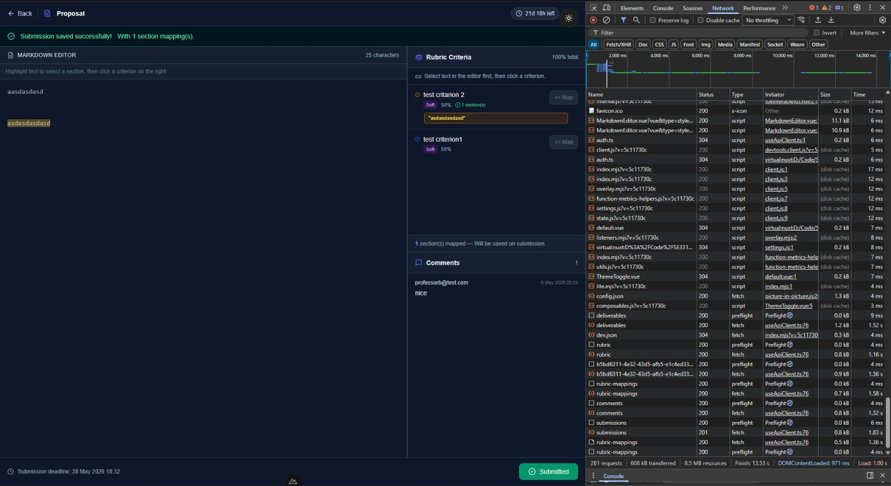

### QA Manual Frontend Test Report: End-to-End Submission Flow

Status: PASSED  
Environment: Windows 11 / Chrome  

---

Test Scope  
This test validates the full end-to-end flow from system setup to student submission and professor evaluation.

---

Test Execution  

System Setup Phase  
Coordinator defines grading rubric and weights sum to 100.  
Coordinator creates sprint successfully.  
Coordinator publishes configuration successfully.  
System transitions to ACTIVE state after publish.  

---

Student Flow (Happy Path)  
Student opens deliverable.  
Student writes content in markdown editor.  
Student maps selected text to rubric criteria.  
Submission is saved successfully.  
UI shows "Submitted" status.  

---

Professor Flow (Happy Path)  
Professor accesses submission review page.  
Submission content is displayed correctly.  
Rubric is visible with correct weights.  
Mapped sections are highlighted correctly.  
Professor can view comments.  

---

Edge Case (Empty Submission)  
When submission has no content, the system displays "No content found in this submission."  
UI does not crash.  
Rubric still loads correctly.  

---

RBAC (Role-Based Access Control)  
Student cannot access professor review endpoints.  
Only authorized roles can access respective pages.  

---

Evidence (Screenshots)  

Setup Phase  
  
  
  

---

Student Flow  
  
  

---

Professor Flow  
  
  

---

Additional UI and Network  
  
  

---

Notes  
All frontend actions correctly trigger backend APIs.  
No UI crashes observed during test execution.  
Edge cases are handled gracefully.  
System is stable and responsive.  

---

Conclusion  
All core functionalities and edge cases have been tested successfully.  
The system is ready for delivery.