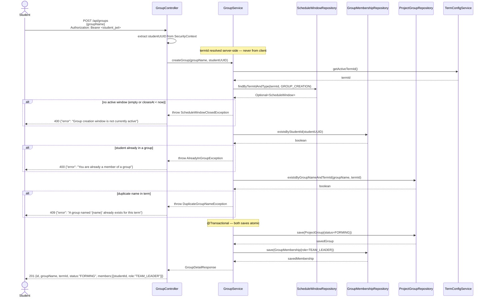
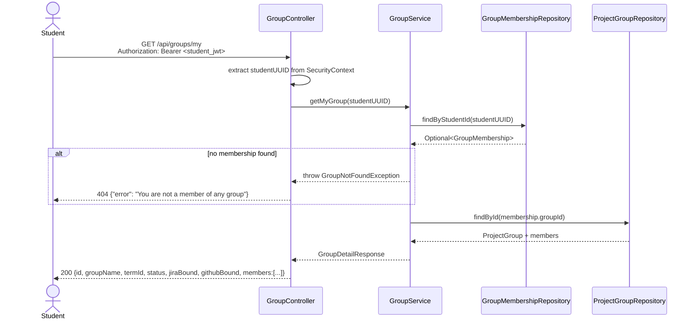

# Sequence Diagram — P2 Sub-Process 2.1
## Validate Schedule & Create Group

> Endpoints: `POST /api/groups`, `GET /api/groups/my`
> Issues: B-01, B-02, B-03, B-05, B-08, B-14
> JWT principal = internal student UUID (not studentId string) — use `studentRepository.findById(UUID)`

---

### POST /api/groups

---

### GET /api/groups/my

