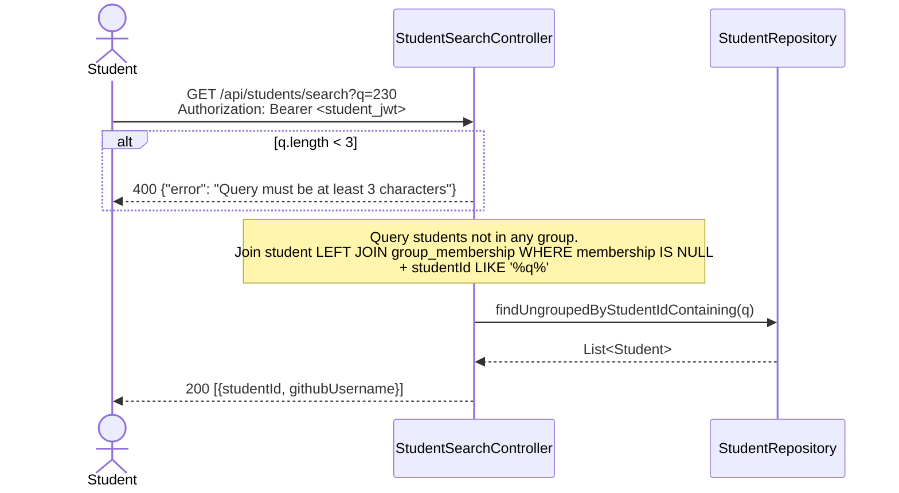
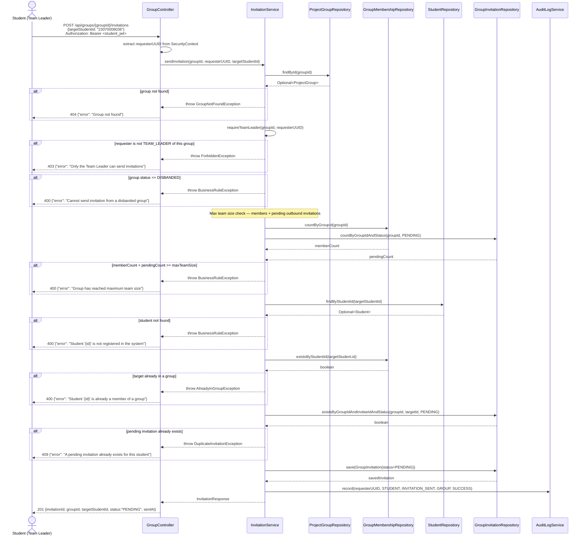
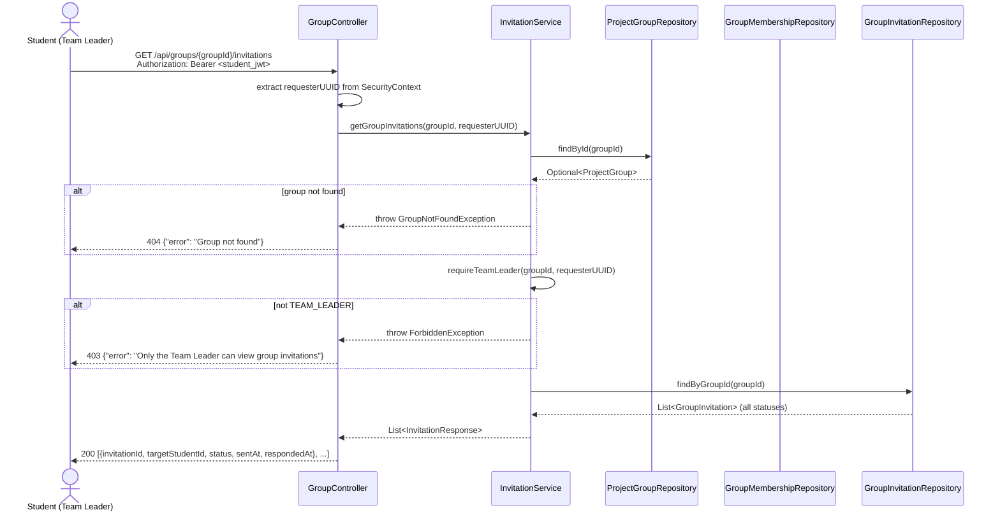
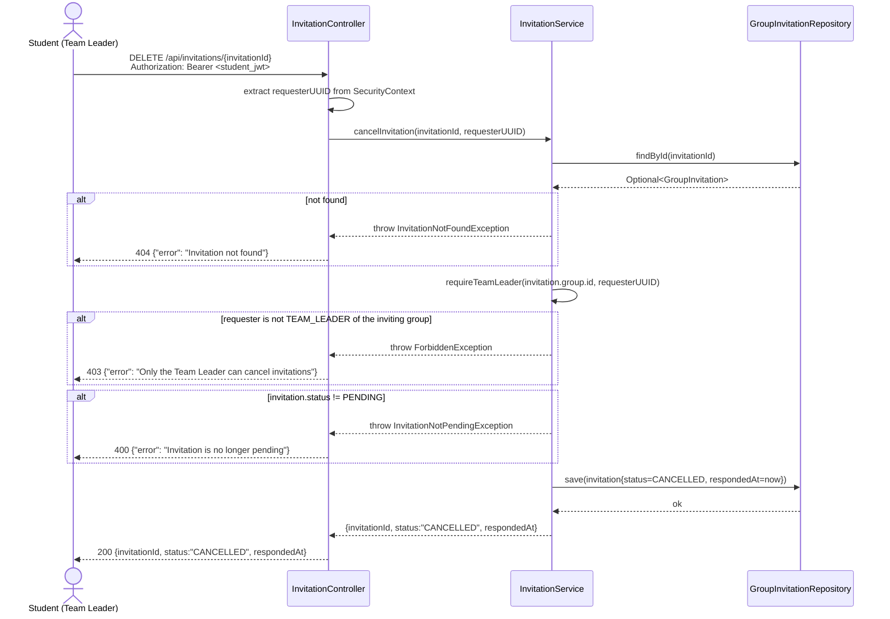

# Sequence Diagram — P2 Sub-Process 2.2
## Search Student & Send / Cancel Invitation

> Endpoints: `GET /api/students/search`, `POST /api/groups/{groupId}/invitations`, `GET /api/groups/{groupId}/invitations`, `DELETE /api/invitations/{invitationId}`
> Issues: B-04, B-05, B-09, B-15, B-17
> JWT principal = internal student UUID
> **Implementation note:** Invitation logic lives in `InvitationService` (extracted from `GroupService`).

---

### GET /api/students/search?q={query}

---

### POST /api/groups/{groupId}/invitations

---

### GET /api/groups/{groupId}/invitations

---

### DELETE /api/invitations/{invitationId}

