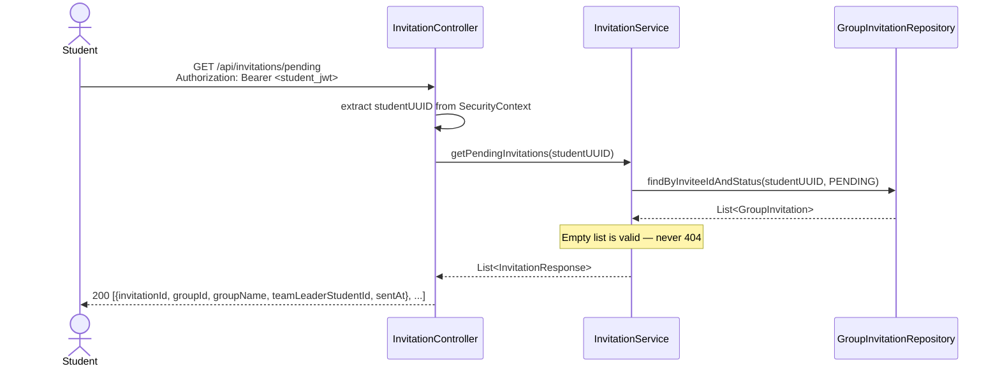
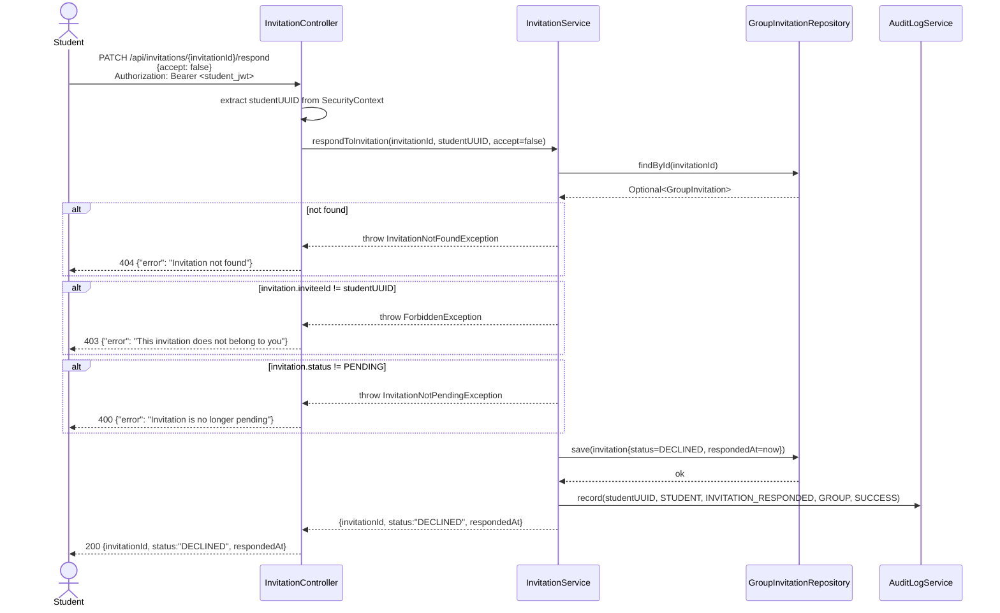
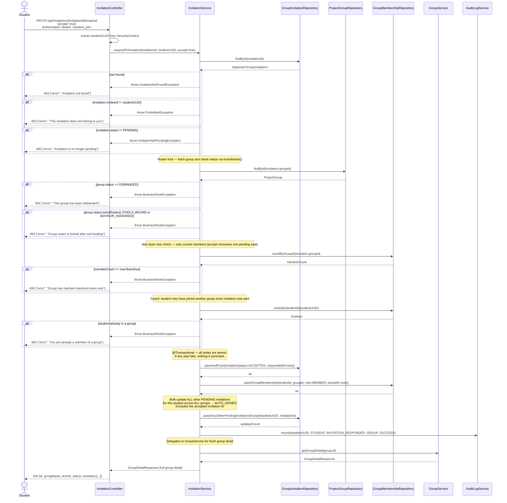

# Sequence Diagram — P2 Sub-Process 2.3
## Process Invitation Response

> Endpoints: `GET /api/invitations/pending`, `PATCH /api/invitations/{invitationId}/respond`
> Issues: B-09, B-15
> JWT principal = internal student UUID
> ⚠️ The ACCEPT path is the most complex transaction in P2 — auto-deny must happen in the same @Transactional call.
> **Implementation note:** Invitation logic lives in `InvitationService` (extracted from `GroupService`).

---

### GET /api/invitations/pending

---

### PATCH /api/invitations/{invitationId}/respond — DECLINED path

---

### PATCH /api/invitations/{invitationId}/respond — ACCEPTED path

