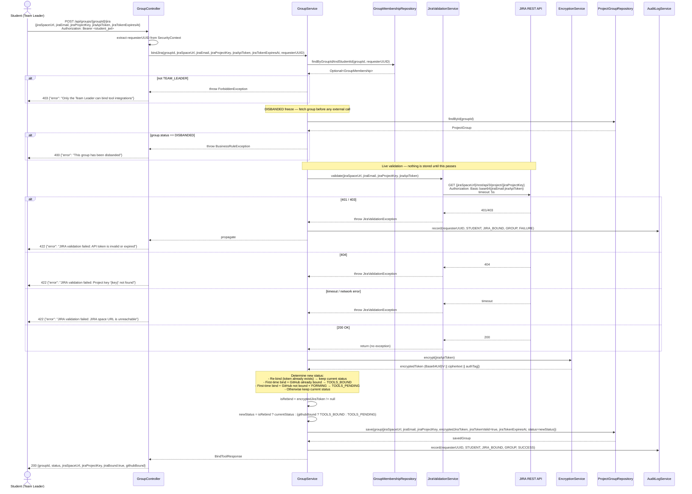
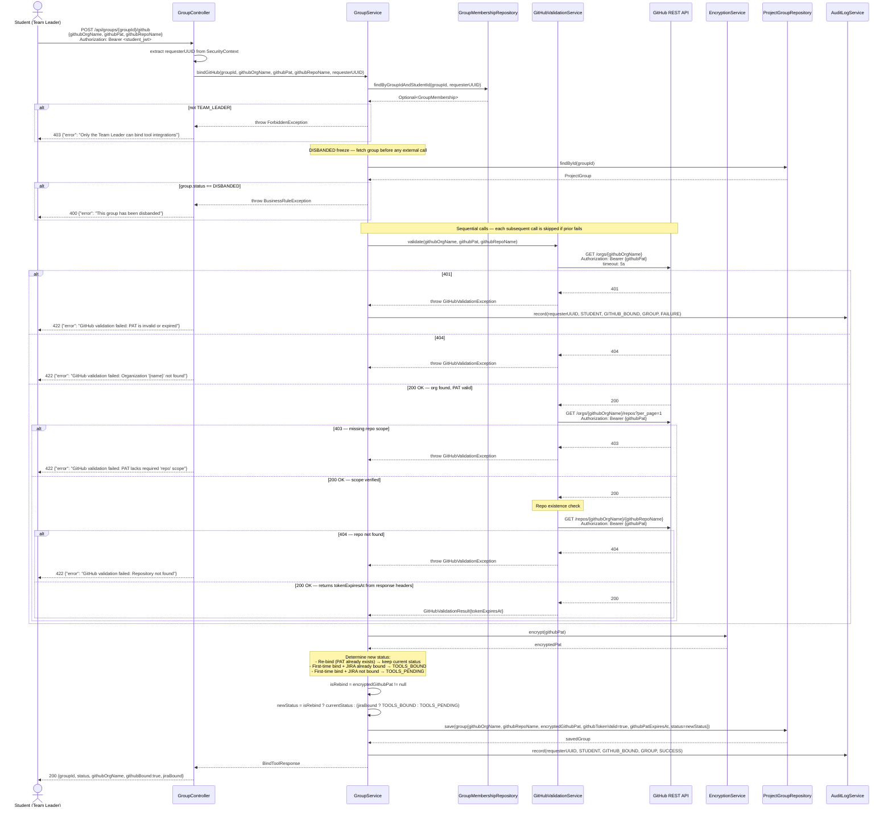

# Sequence Diagram — P2 Sub-Processes 2.4 & 2.5
## Validate & Bind JIRA / GitHub

> Endpoints: `POST /api/groups/{groupId}/jira`, `POST /api/groups/{groupId}/github`
> Issues: B-06, B-10, B-11, B-12, B-14
> JWT principal = internal student UUID
> Both flows are structurally similar — JIRA shown in full, GitHub shown with diffs only.
> **Implementation note:** Both bind methods support re-bind (token rotation) — on re-bind, credentials are overwritten but group status is preserved.

---

### POST /api/groups/{groupId}/jira (Bind JIRA)

---

### POST /api/groups/{groupId}/github (Bind GitHub)

