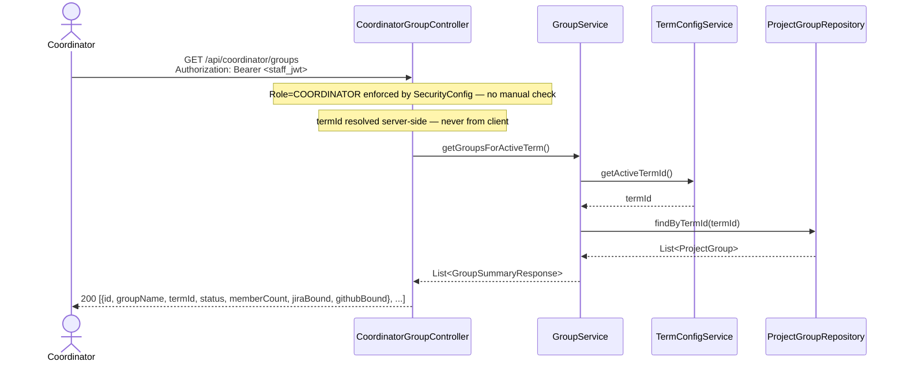
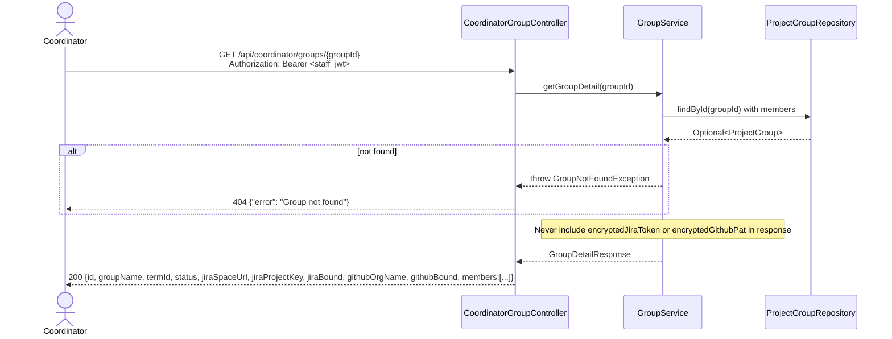
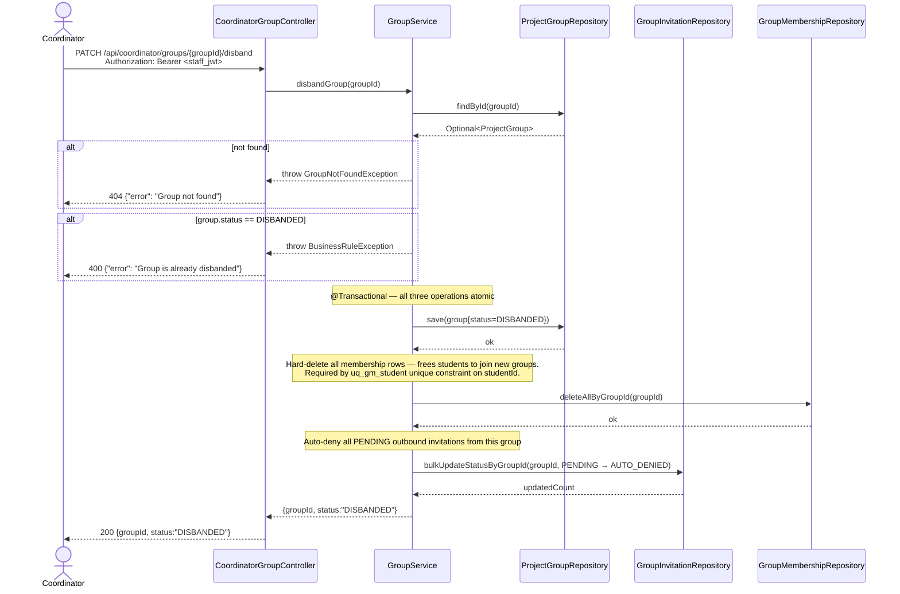

# Sequence Diagram — P2 Sub-Process 2.6
## Coordinator Group Override

> Endpoints: `GET /api/coordinator/groups`, `GET /api/coordinator/groups/{groupId}`, `PATCH /api/coordinator/groups/{groupId}/members`, `PATCH /api/coordinator/groups/{groupId}/disband`
> Issues: B-13, B-16
> Auth: Staff JWT with role=Coordinator — enforced by SecurityConfig (`hasRole("COORDINATOR")`), no manual check needed in controller.

---

### GET /api/coordinator/groups

> ⚠️ ADR update: `termId` was removed as a query param. Resolved server-side via `TermConfigService.getActiveTermId()`.



---

### GET /api/coordinator/groups/{groupId}



---

### PATCH /api/coordinator/groups/{groupId}/members

```mermaid
sequenceDiagram
    actor Coordinator
    participant CoordinatorGroupController
    participant GroupService
    participant ProjectGroupRepository
    participant StudentRepository
    participant GroupMembershipRepository

    Coordinator->>CoordinatorGroupController: PATCH /api/coordinator/groups/{groupId}/members<br/>{studentId, action:"ADD"|"REMOVE"}<br/>Authorization: Bearer <staff_jwt>

    alt action is not ADD or REMOVE
        CoordinatorGroupController-->>Coordinator: 400 {"error": "action must be ADD or REMOVE"}
    end

    alt action == ADD
        CoordinatorGroupController->>GroupService: coordinatorAddStudent(groupId, studentId)

        GroupService->>ProjectGroupRepository: findById(groupId)
        ProjectGroupRepository-->>GroupService: Optional<ProjectGroup>

        alt group not found
            GroupService-->>CoordinatorGroupController: throw GroupNotFoundException
            CoordinatorGroupController-->>Coordinator: 404 {"error": "Group not found"}
        end

        GroupService->>StudentRepository: findByStudentId(studentId)
        StudentRepository-->>GroupService: Optional<Student>

        alt student not found
            GroupService-->>CoordinatorGroupController: throw StudentNotFoundException
            CoordinatorGroupController-->>Coordinator: 404 {"error": "Student '{id}' not found"}
        end

        GroupService->>GroupMembershipRepository: existsByStudentId(student.id)
        GroupMembershipRepository-->>GroupService: boolean

        alt already in a group
            GroupService-->>CoordinatorGroupController: throw AlreadyInGroupException
            CoordinatorGroupController-->>Coordinator: 400 {"error": "Student '{id}' is already a member of a group"}
        end

        Note over GroupService: Max team size check (coordinator force-add also enforces cap)
        GroupService->>TermConfigService: getMaxTeamSize()
        TermConfigService-->>GroupService: maxTeamSize
        GroupService->>GroupMembershipRepository: countByGroupId(groupId)
        GroupMembershipRepository-->>GroupService: memberCount

        alt memberCount >= maxTeamSize
            GroupService-->>CoordinatorGroupController: throw BusinessRuleException
            CoordinatorGroupController-->>Coordinator: 400 {"error": "Group has reached maximum team size"}
        end

        Note over GroupService: @Transactional — membership save + auto-deny atomic
        GroupService->>GroupMembershipRepository: save(GroupMembership{role=MEMBER})
        GroupMembershipRepository-->>GroupService: ok

        Note over GroupService: Auto-deny all PENDING invitations for this student (same as acceptance path)
        GroupService->>GroupInvitationRepository: bulkUpdateStatus(inviteeId=student.id, PENDING → AUTO_DENIED)
        GroupInvitationRepository-->>GroupService: updatedCount

    else action == REMOVE
        CoordinatorGroupController->>GroupService: coordinatorRemoveStudent(groupId, studentId)

        GroupService->>StudentRepository: findByStudentId(studentId)
        StudentRepository-->>GroupService: Optional<Student>

        alt student not found
            GroupService-->>CoordinatorGroupController: throw StudentNotFoundException
            CoordinatorGroupController-->>Coordinator: 404 {"error": "Student '{id}' not found"}
        end

        GroupService->>GroupMembershipRepository: findByGroupIdAndStudentId(groupId, student.id)
        GroupMembershipRepository-->>GroupService: Optional<GroupMembership>

        alt membership not found
            GroupService-->>CoordinatorGroupController: throw GroupNotFoundException
            CoordinatorGroupController-->>Coordinator: 404 {"error": "Group not found"}
        end

        alt membership.role == TEAM_LEADER
            GroupService-->>CoordinatorGroupController: throw ForbiddenException
            CoordinatorGroupController-->>Coordinator: 400 {"error": "Cannot remove Team Leader; transfer leadership first"}
        end

        GroupService->>GroupMembershipRepository: delete(membership)
        GroupMembershipRepository-->>GroupService: ok
    end

    GroupService-->>CoordinatorGroupController: GroupDetailResponse (refreshed)
    CoordinatorGroupController-->>Coordinator: 200 {full group detail with updated members}
```

---

### PATCH /api/coordinator/groups/{groupId}/disband


