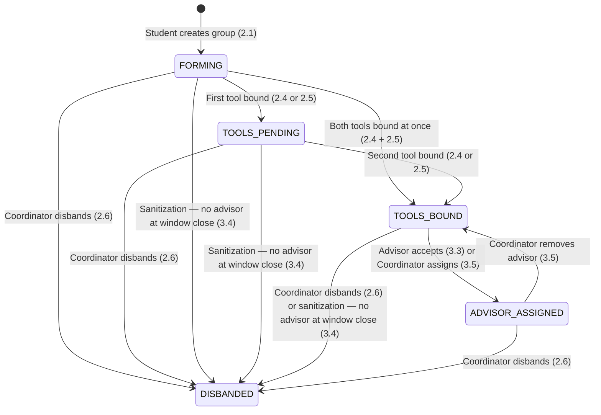
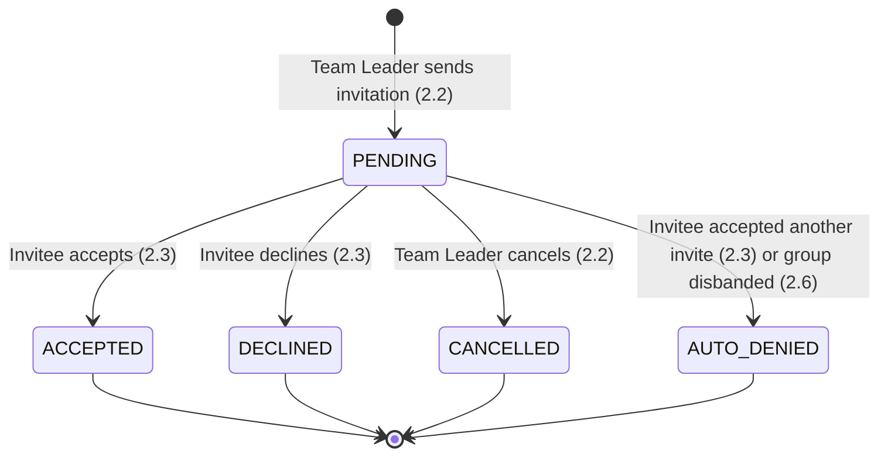

# P2 State Machine Diagrams

---

## Group Status (P2 + P3 — full lifecycle)

---

## Invitation Status

---

## Combined View — What triggers each Group transition

| From | To | Trigger | Sub-process |
|---|---|---|---|
| *(new)* | `FORMING` | Student creates group | 2.1 |
| `FORMING` | `TOOLS_PENDING` | First tool (JIRA or GitHub) bound | 2.4 / 2.5 |
| `FORMING` | `TOOLS_BOUND` | Both tools bound at same time | 2.4 / 2.5 |
| `TOOLS_PENDING` | `TOOLS_BOUND` | Second tool bound | 2.4 / 2.5 |
| `TOOLS_BOUND` | `ADVISOR_ASSIGNED` | Advisor accepts request | 3.3 |
| `TOOLS_BOUND` | `ADVISOR_ASSIGNED` | Coordinator force-assigns advisor | 3.5 |
| `ADVISOR_ASSIGNED` | `TOOLS_BOUND` | Coordinator removes advisor | 3.5 |
| `FORMING` | `DISBANDED` | Sanitization — no advisor at window close | 3.4 |
| `TOOLS_PENDING` | `DISBANDED` | Sanitization — no advisor at window close | 3.4 |
| `TOOLS_BOUND` | `DISBANDED` | Sanitization — no advisor at window close | 3.4 |
| any | `DISBANDED` | Coordinator force-disbands | 2.6 |
