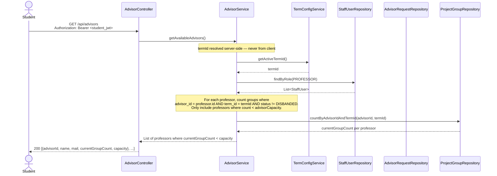
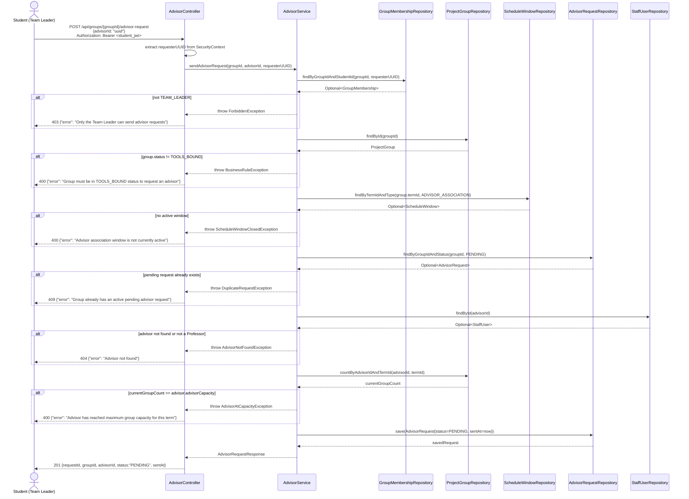
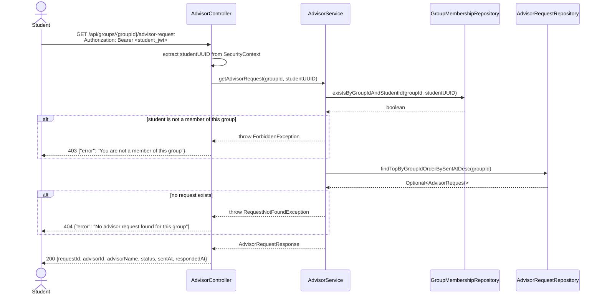
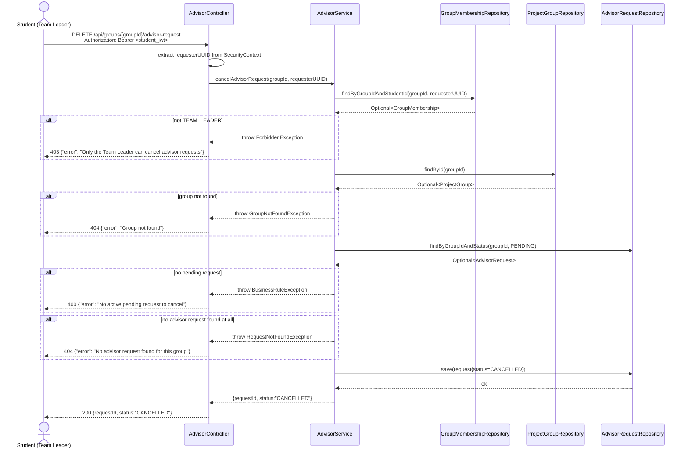

# Sequence Diagram — P3 Sub-Process 3.1
## Browse Advisors & Send / Cancel Advisor Request

> Endpoints: `GET /api/advisors`, `POST /api/groups/{groupId}/advisor-request`, `GET /api/groups/{groupId}/advisor-request`, `DELETE /api/groups/{groupId}/advisor-request`
> Issues: P3-API-01
> JWT principal = internal student UUID
> Prerequisite: group must be in TOOLS_BOUND status (output of P2)

---

### GET /api/advisors

---

### POST /api/groups/{groupId}/advisor-request

---

### GET /api/groups/{groupId}/advisor-request

---

### DELETE /api/groups/{groupId}/advisor-request

