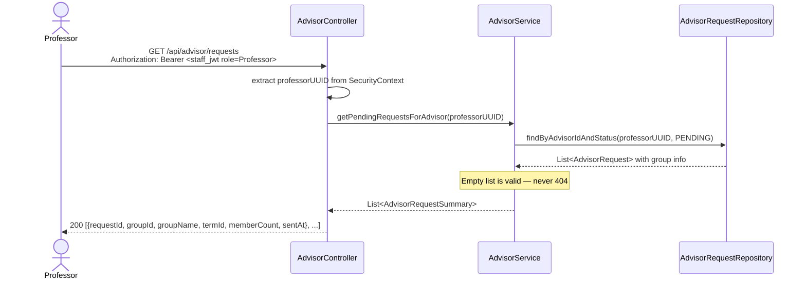
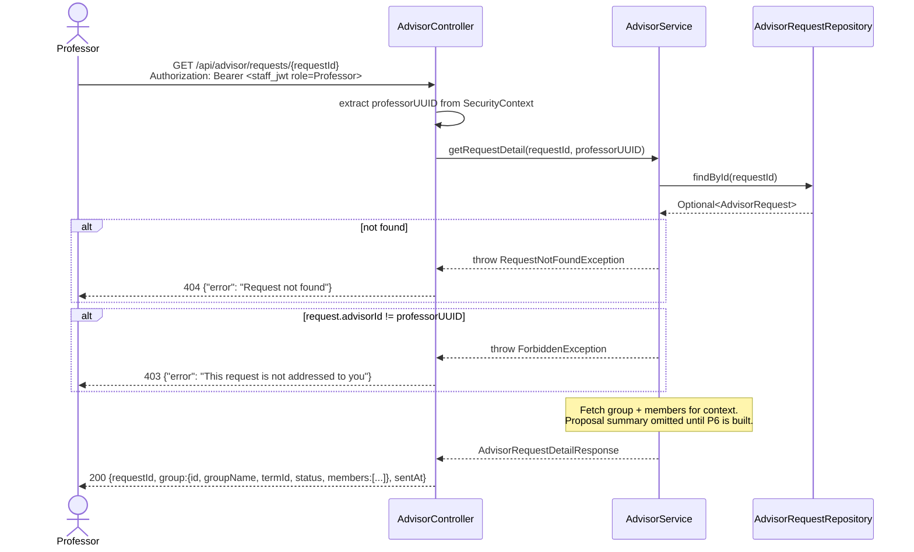
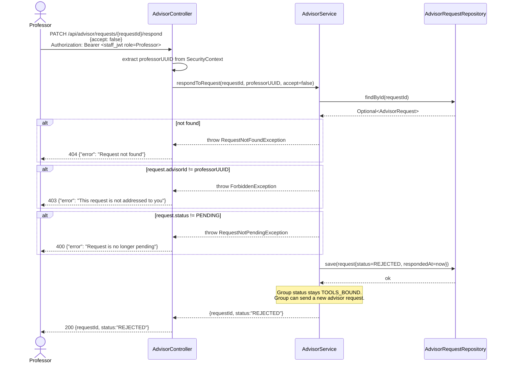
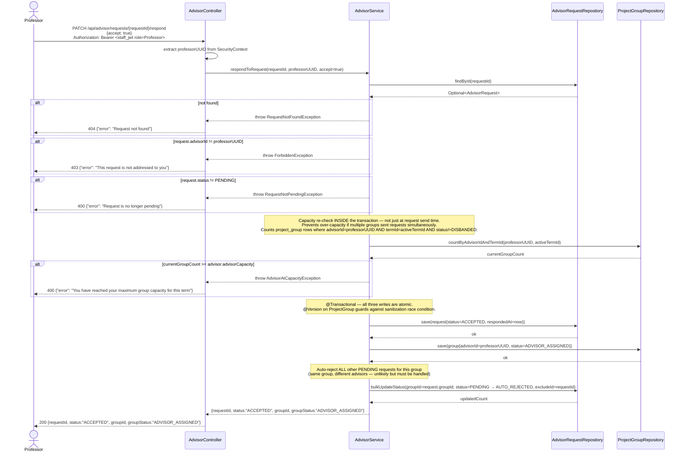

# Sequence Diagram — P3 Sub-Processes 3.2 & 3.3
## Advisor Reviews Requests & Processes Response

> Endpoints: `GET /api/advisor/requests`, `GET /api/advisor/requests/{requestId}`, `PATCH /api/advisor/requests/{requestId}/respond`
> Issues: P3-API-02, P3-API-03
> Auth: Staff JWT with role=Professor
> ⚠️ `/api/advisor/**` must be protected with `hasRole("PROFESSOR")` in SecurityConfig (blue team action item)
> JWT principal = internal StaffUser UUID (same pattern as student: claims.get("id"))

---

### GET /api/advisor/requests

---

### GET /api/advisor/requests/{requestId}

---

### PATCH /api/advisor/requests/{requestId}/respond — REJECTED path

---

### PATCH /api/advisor/requests/{requestId}/respond — ACCEPTED path

