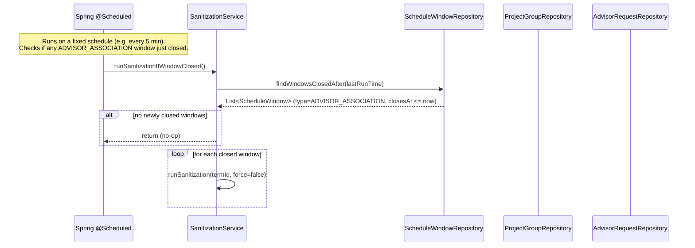
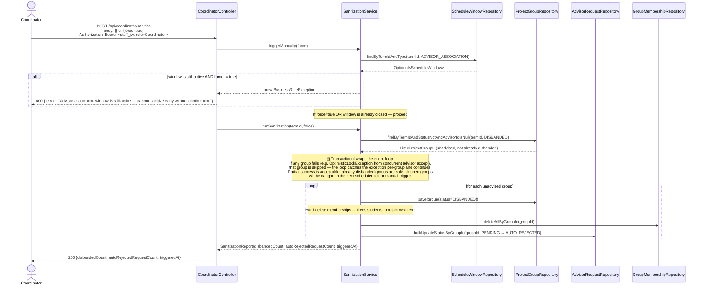

# Sequence Diagram — P3 Sub-Process 3.4
## Auto-Sanitization (Disband Unadvised Groups)

> Endpoint: `POST /api/coordinator/sanitize`
> Issues: P3-API-04
> Two triggers: (1) scheduled job fires automatically when ADVISOR_ASSOCIATION window closes, (2) coordinator manual trigger via API.
> Both paths call the same SanitizationService method.

---

### Trigger 1 — Scheduled Job (Automatic)

---

### POST /api/coordinator/sanitize (Manual Trigger)

