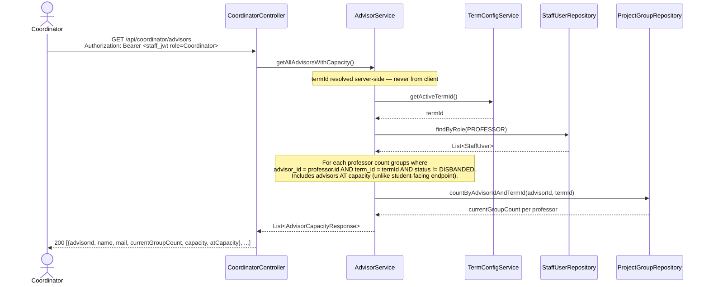
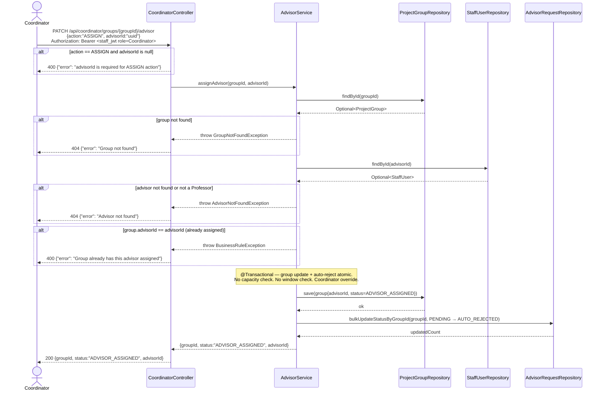
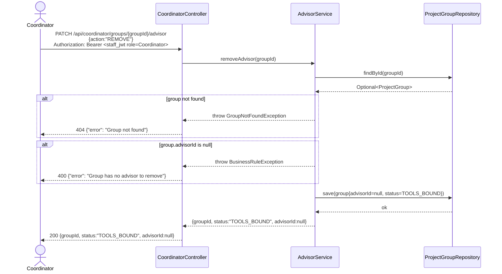

# Sequence Diagram — P3 Sub-Process 3.5
## Coordinator Advisor Override

> Endpoints: `GET /api/coordinator/advisors`, `PATCH /api/coordinator/groups/{groupId}/advisor`
> Issues: P3-API-05
> Auth: Staff JWT with role=Coordinator — enforced by SecurityConfig
> Override bypasses both the schedule window check and the advisor capacity limit.

---

### GET /api/coordinator/advisors

---

### PATCH /api/coordinator/groups/{groupId}/advisor — ASSIGN

---

### PATCH /api/coordinator/groups/{groupId}/advisor — REMOVE

