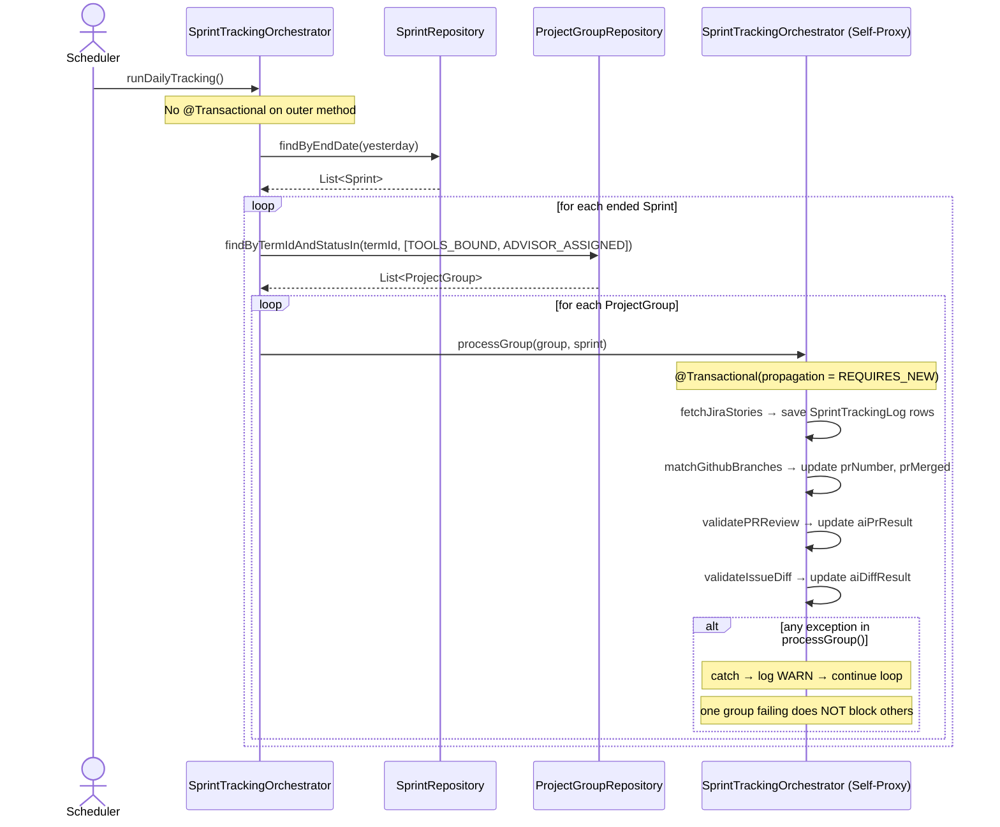
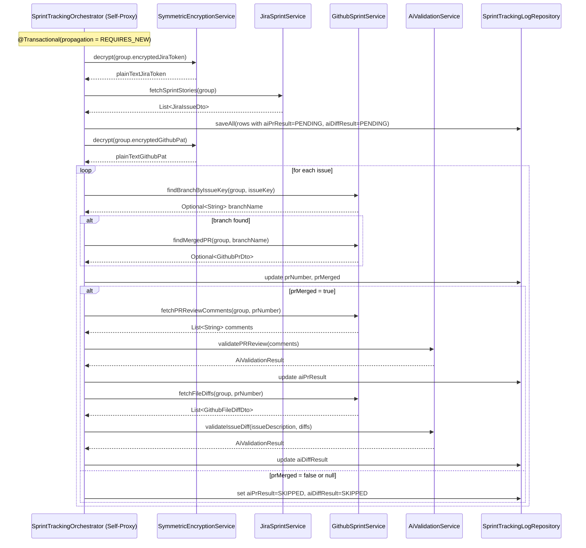

# Sequence Diagram — P5 Sub-Process 5.0
## End-of-Sprint Tracking Orchestrator (Automated Pipeline)

> Scheduler: `@Scheduled(cron = "0 0 1 * * *")` — daily at 01:00 UTC
> Issues: #153 (Orchestrator), #148 (SprintTrackingLogRepository), #149 (JIRA), #150 (GitHub), #151 (AI PR), #152 (AI Diff)
> Pattern: self-proxy + `REQUIRES_NEW` per group — identical to `SanitizationService.java`
> No REST endpoint — triggered by cron OR by `SprintTrackingOrchestrator.triggerForSprint()` (called from 5.7)
> **MIGRATION NOTE:** `Sprint` entity requires a new `termId` column. Must be `@Column(nullable = true)` — Hibernate `ddl-auto=update` runs `ALTER TABLE sprint ADD COLUMN term_id` on an existing table; NOT NULL without a default will fail if rows exist. Set via `TermConfigService.getActiveTermId()` inside `SprintService.createSprint()`.

---

### runDailyTracking() — Scheduler Entry Point

---

### processGroup() — Per-Group Transaction Detail

