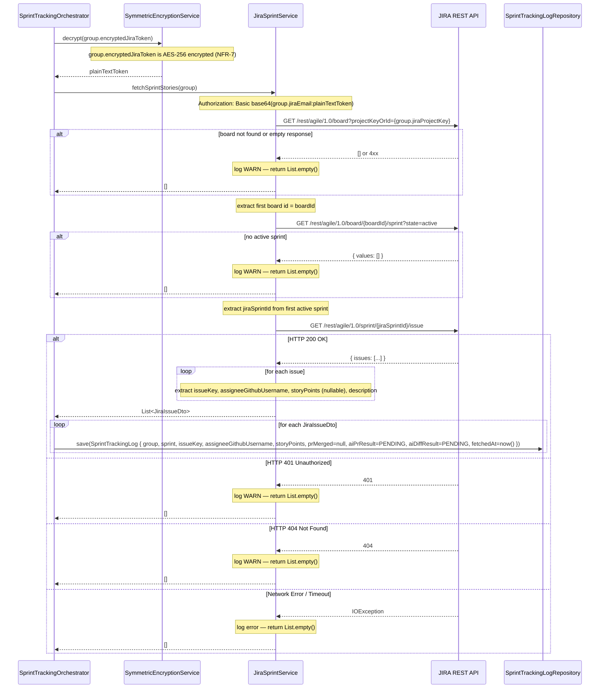

# Sequence Diagram — P5 Sub-Process 5.1
## JIRA Sprint Story Fetch

> Called by: `SprintTrackingOrchestrator.processGroup()` (see 5.0)
> Issues: #149 (JiraSprintService), #148 (SprintTrackingLog entity)
> Spec: IR-2, P5 Step 2, NFR-7 (token encrypted at rest)

---

### JiraSprintService.fetchSprintStories(group)

