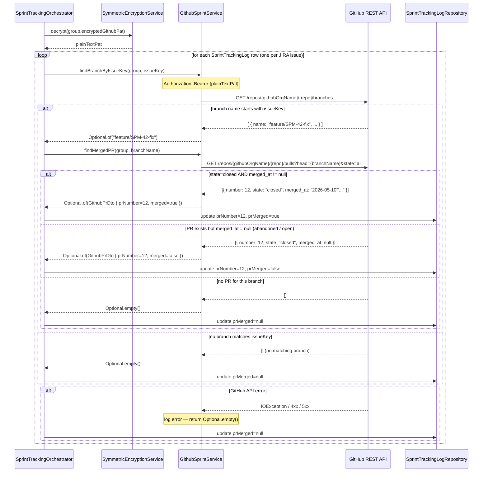

# Sequence Diagram — P5 Sub-Process 5.2
## GitHub Branch & PR Matching

> Called by: `SprintTrackingOrchestrator.processGroup()` (see 5.0)
> Issues: #150 (GithubSprintService), #148 (SprintTrackingLog entity)
> Spec: IR-3, P5 Steps 3–4, NFR-7
> IMPORTANT: `GithubSprintService` is a completely separate class from `GithubService.java` — do NOT extend it

---

### GithubSprintService.findBranchByIssueKey() + findMergedPR()

