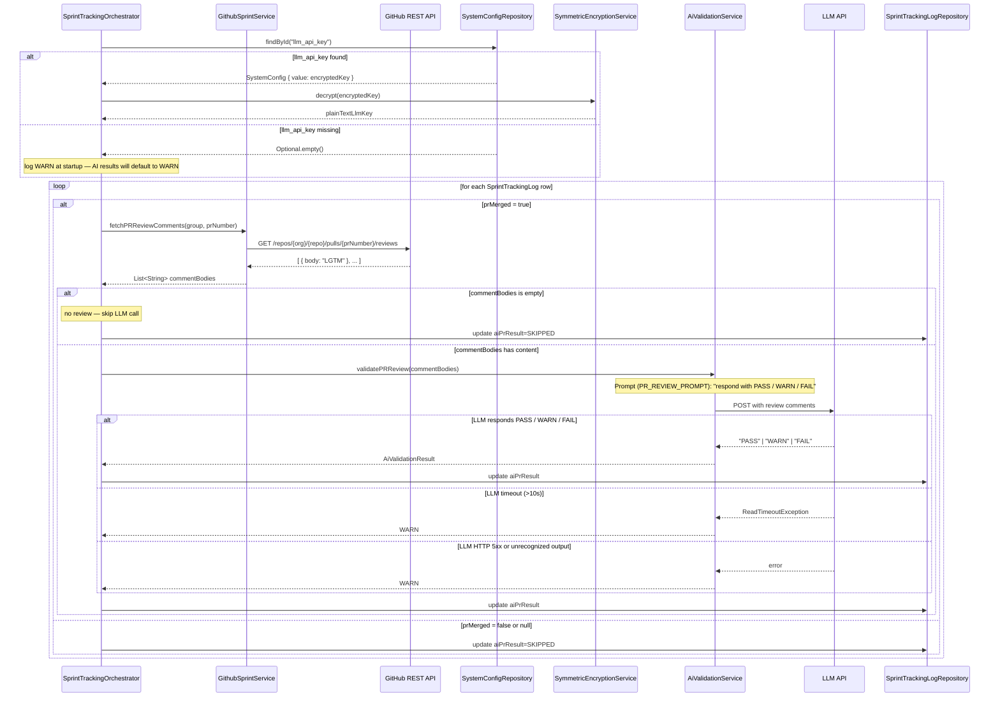

# Sequence Diagram — P5 Sub-Process 5.3
## AI PR Review Quality Validation

> Called by: `SprintTrackingOrchestrator.processGroup()` (see 5.0)
> Issues: #151 (AiValidationService — shared foundation + validatePRReview), #148 (AiValidationResult enum)
> Spec: FR-19, IR-4, P5 Step 5

---

### AiValidationService.validatePRReview(comments)

