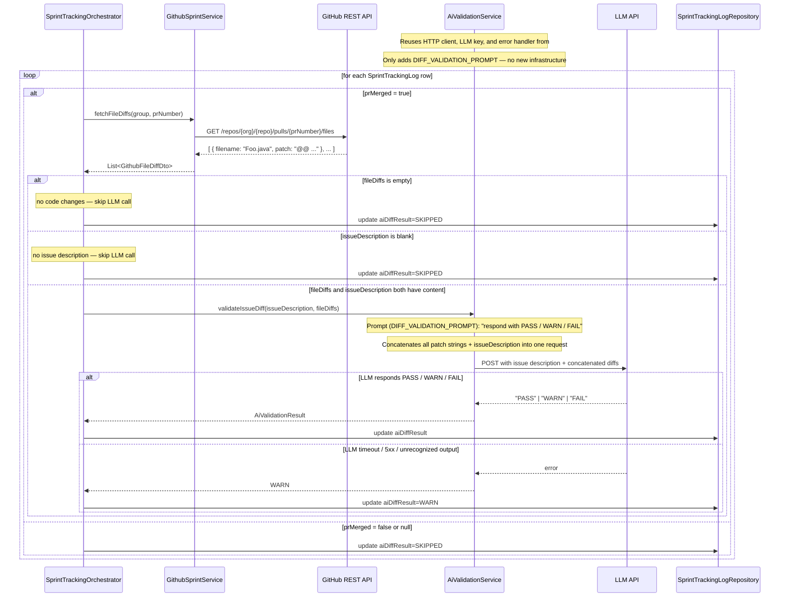

# Sequence Diagram — P5 Sub-Process 5.4
## AI Issue-to-Code Diff Validation

> Called by: `SprintTrackingOrchestrator.processGroup()` (see 5.0)
> Issues: #152 (adds validateIssueDiff to AiValidationService from #151), #150 (GithubFileDiffDto), #148 (AiValidationResult enum)
> Spec: FR-20, IR-4, P5 Step 6
> IMPORTANT: #152 depends on #151 being merged first — both methods live in the same class

---

### AiValidationService.validateIssueDiff(issueDescription, fileDiffs)

