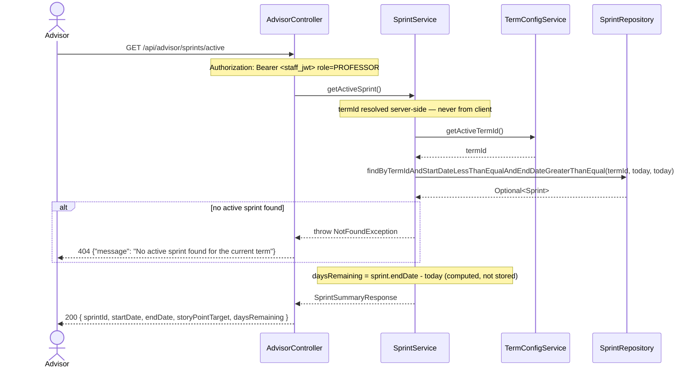
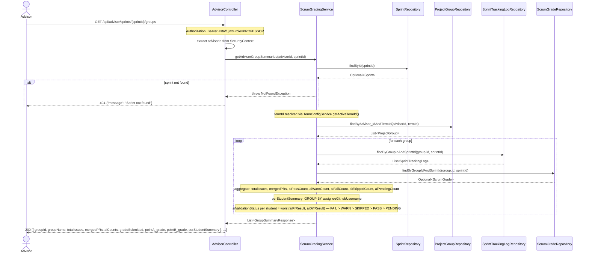
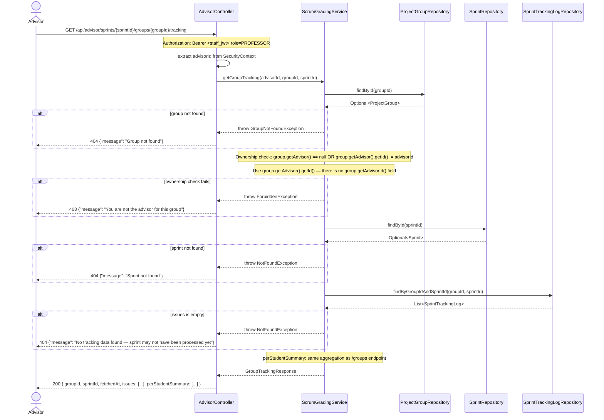

# Sequence Diagram — P5 Sub-Process 5.5a
## Advisor Sprint Tracking Read

> Endpoints: `GET /api/advisor/sprints/active`, `GET /api/advisor/sprints/{sprintId}/groups`, `GET /api/advisor/sprints/{sprintId}/groups/{groupId}/tracking`
> Issues: #154 (AdvisorController + ScrumGradingService)
> Note: `ProjectGroupRepository.findByAdvisor_IdAndTermId(UUID, String)` does NOT exist yet — must be added as part of #154
> JWT principal = Staff UUID, role = PROFESSOR

---

### GET /api/advisor/sprints/active

---

### GET /api/advisor/sprints/{sprintId}/groups

---

### GET /api/advisor/sprints/{sprintId}/groups/{groupId}/tracking

