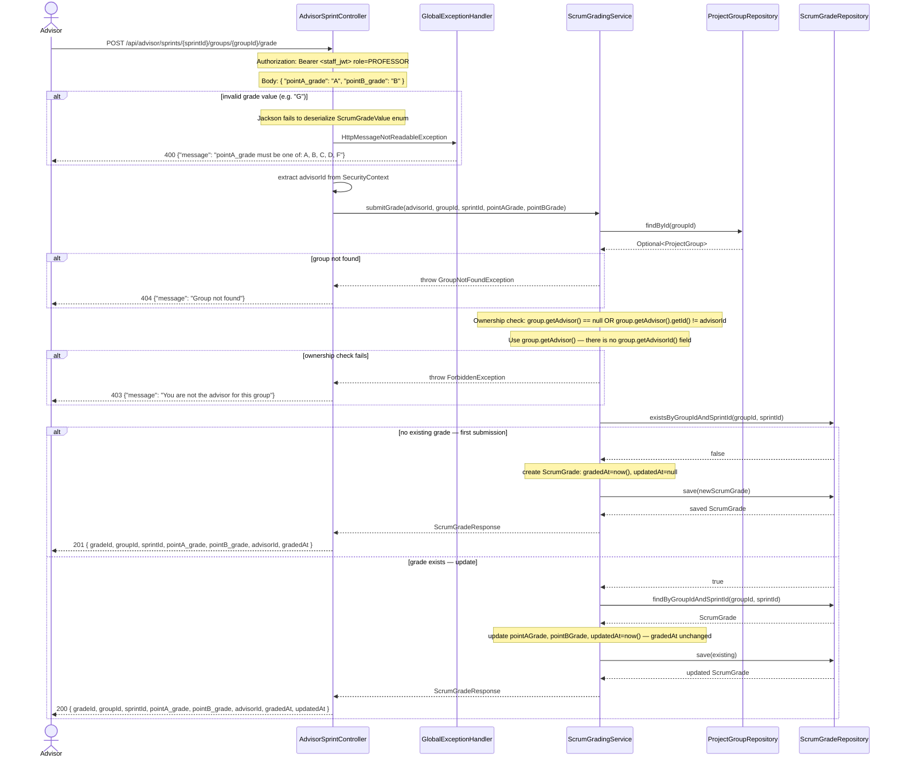
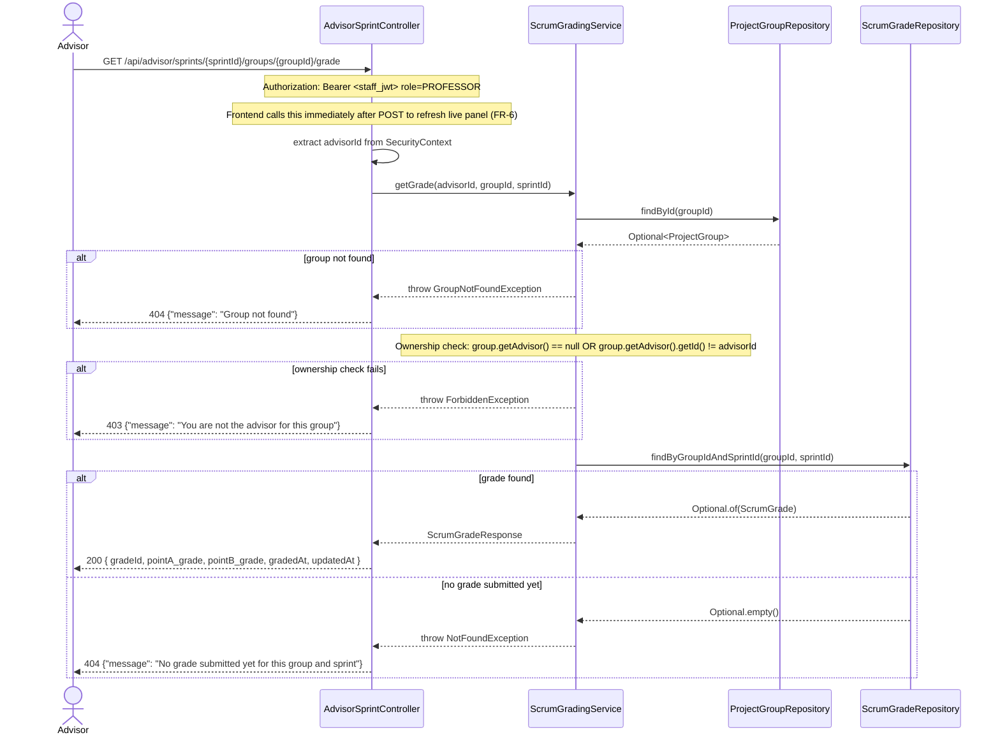

# Sequence Diagram — P5 Sub-Process 5.5b
## Advisor Scrum Grade Submission

> Endpoints: `POST /api/advisor/sprints/{sprintId}/groups/{groupId}/grade`, `GET /api/advisor/sprints/{sprintId}/groups/{groupId}/grade`
> Issues: #154 (ScrumGradingService + AdvisorSprintController)
> JWT principal = Staff UUID, role = PROFESSOR
> Spec: FR-6, P5 Steps 8–10

---

### POST /api/advisor/sprints/{sprintId}/groups/{groupId}/grade

---

### GET /api/advisor/sprints/{sprintId}/groups/{groupId}/grade

