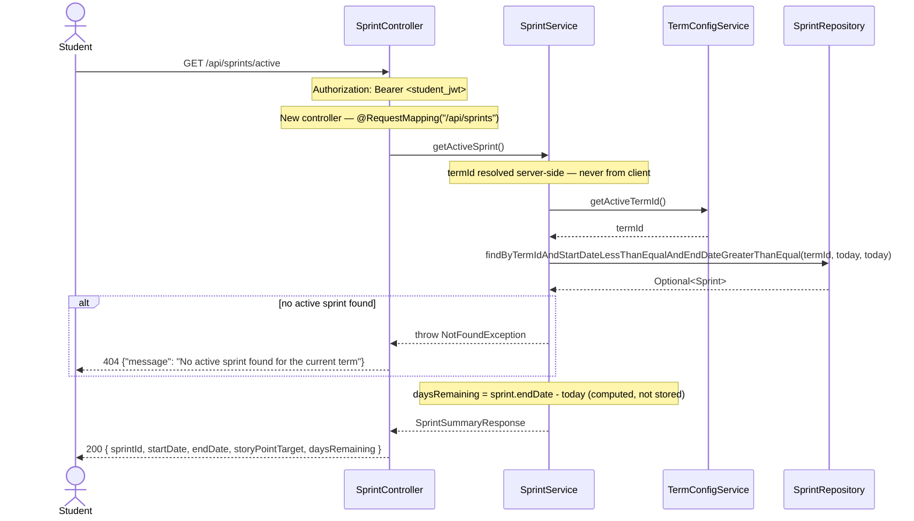
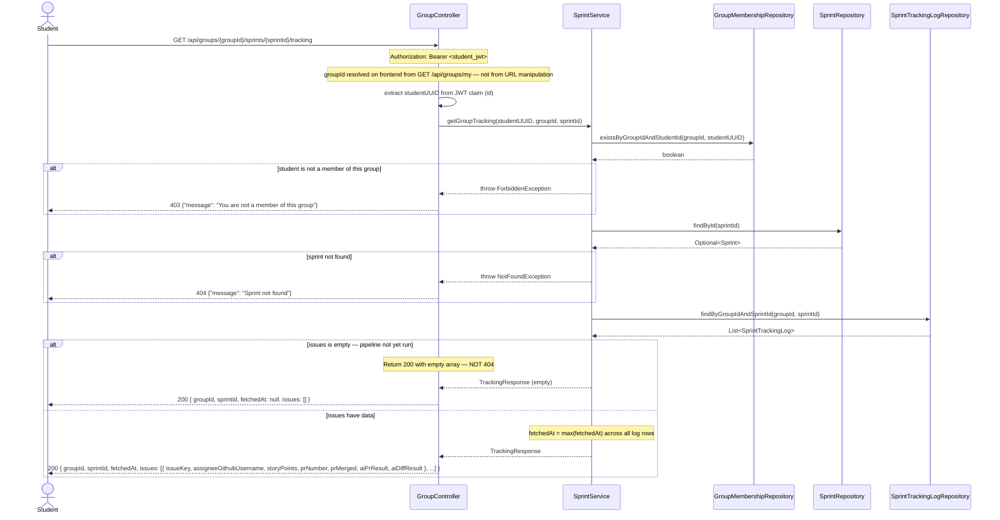

# Sequence Diagram — P5 Sub-Process 5.6
## Student Sprint Tracking View

> Endpoints: `GET /api/sprints/active`, `GET /api/groups/{groupId}/sprints/{sprintId}/tracking`
> Issues: #154 (student endpoints 6–7), #157 (Frontend — depends on #156 for AiResultBadge.vue)
> JWT principal = Student, claim `id` (UUID of Student entity)
> Spec: FR-7, P5 Step 7

---

### GET /api/sprints/active

---

### GET /api/groups/{groupId}/sprints/{sprintId}/tracking

