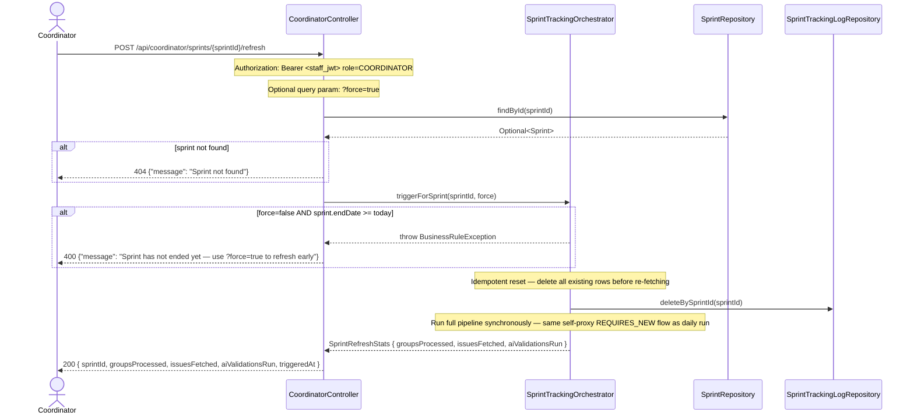
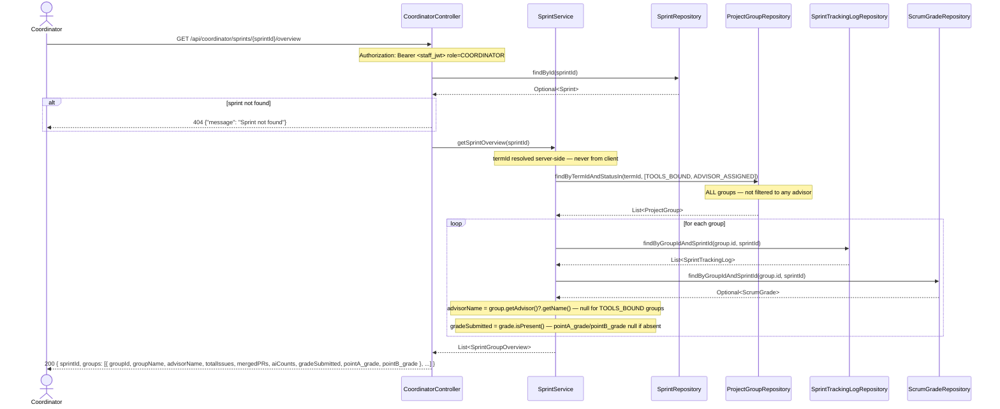

# Sequence Diagram — P5 Sub-Process 5.7
## Coordinator Sprint Control

> Endpoints: `POST /api/coordinator/sprints/{sprintId}/refresh`, `GET /api/coordinator/sprints/{sprintId}/overview`
> Issues: #155 (CoordinatorController)
> JWT principal = Staff UUID, role = COORDINATOR
> Pattern: mirrors `SanitizationController.java` exactly

---

### POST /api/coordinator/sprints/{sprintId}/refresh

---

### GET /api/coordinator/sprints/{sprintId}/overview

