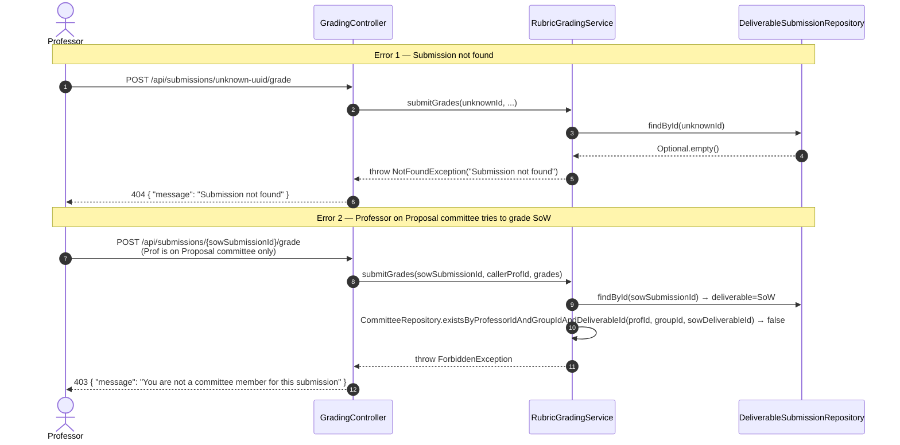

# SD-P7-1 — Rubric Grading (Sub-Process 7.1)

**Endpoint:** `POST /api/submissions/{submissionId}/grade`  
**Auth:** Professor JWT; caller must be a committee member for the submission's deliverable + group.  
**Issues:** P7-02 (RubricGrade entity), P7-03 (GradeValueMapper), P7-04 (RubricGradingService)

---

## Happy Path — First-Time Grade Submission

```mermaid
sequenceDiagram
    autonumber
    actor Prof as Professor (Committee Member)
    participant FE as Frontend<br/>(grade.vue)
    participant GC as GradingController
    participant RGS as RubricGradingService
    participant DSRepo as DeliverableSubmissionRepository
    participant CommRepo as CommitteeRepository
    participant CritRepo as RubricCriterionRepository
    participant GVM as GradeValueMapper
    participant RGRepo as RubricGradeRepository
    participant DB as MySQL

    Prof->>FE: Fills rubric form, clicks "Submit Grades"
    FE->>GC: POST /api/submissions/{submissionId}/grade<br/>Bearer: professorJWT<br/>body: { grades: [{ criterionId, selectedGrade }] }

    GC->>RGS: submitGrades(submissionId, callerStaffUserId, grades)

    Note over RGS: Step 1 — Resolve Submission
    RGS->>DSRepo: findById(submissionId)
    DSRepo->>DB: SELECT * FROM deliverable_submission WHERE id = ?
    DB-->>DSRepo: DeliverableSubmission row
    DSRepo-->>RGS: DeliverableSubmission (deliverableId, groupId)

    Note over RGS: Step 2 — Committee Auth Check (deliverable-scoped)
    RGS->>CommRepo: existsByProfessorIdAndGroupIdAndDeliverableId(callerId, groupId, deliverableId)
    CommRepo->>DB: SELECT COUNT > 0 FROM committee c<br/>JOIN committee_professor cp<br/>JOIN committee_group cg<br/>WHERE cp.professor_id=? AND cg.group_id=? AND c.deliverable_id=?
    DB-->>CommRepo: true / false
    CommRepo-->>RGS: isMember: boolean

    alt isMember == false
        RGS-->>GC: throw ForbiddenException("You are not a committee member for this submission")
        GC-->>FE: 403 { "message": "You are not a committee member for this submission" }
        FE-->>Prof: Error toast shown
    end

    Note over RGS: Step 3 — Grade Validation per Criterion
    loop for each grade in payload
        RGS->>CritRepo: findById(criterionId)
        CritRepo->>DB: SELECT * FROM rubricCriterion WHERE id = ?
        DB-->>CritRepo: RubricCriterion (gradingType, weight)
        CritRepo-->>RGS: RubricCriterion

        RGS->>GVM: validateGrade(gradingType, selectedGrade)
        Note over GVM: Binary → only "S" or "F" valid<br/>Soft → only "A","B","C","D","F" valid

        alt validation fails
            RGS-->>GC: throw BadRequestException("Invalid grade for criterion")
            GC-->>FE: 400 { "message": "Invalid grade 'X' for Binary criterion <id>" }
            FE-->>Prof: Validation error shown
        end
    end

    Note over RGS: Step 4 — Upsert RubricGrade rows
    loop for each grade in payload
        RGS->>RGRepo: findBySubmissionIdAndCriterionIdAndReviewerId(submissionId, criterionId, callerStaffUserId)
        RGRepo->>DB: SELECT * FROM rubric_grade WHERE submission_id=? AND criterion_id=? AND reviewer_id=?
        DB-->>RGRepo: Optional<RubricGrade>

        alt row not found (first time)
            RGS->>RGRepo: save(new RubricGrade { submission, criterion, reviewer, selectedGrade, gradedAt=now })
            RGRepo->>DB: INSERT INTO rubric_grade ...
        else row found (update)
            RGS->>RGRepo: save(existing with selectedGrade updated, gradedAt=now)
            RGRepo->>DB: UPDATE rubric_grade SET selected_grade=?, graded_at=? WHERE id=?
        end
    end

    Note over RGS: Step 5 — Compute Base Deliverable Grade (B)
    RGS->>RGRepo: findBySubmissionId(submissionId)
    RGRepo->>DB: SELECT * FROM rubric_grade WHERE submission_id=?
    DB-->>RGRepo: List<RubricGrade> (all reviewers for this submission)
    RGRepo-->>RGS: allGrades

    Note over RGS: B = AVG_reviewers( SUM_criteria(numericGrade × weight) / SUM(weight) )<br/>GradeValueMapper.toNumeric(gradingType, selectedGrade) used here

    RGS->>GVM: toNumeric(gradingType, selectedGrade) [per grade]
    GVM-->>RGS: numeric score (100/80/60/50/0)

    RGS-->>GC: RubricGradeSubmitResult { submissionId, reviewerId, baseDeliverableGrade }

    alt first-time grade
        GC-->>FE: 201 { submissionId, reviewerId, baseDeliverableGrade: 85.5 }
    else update
        GC-->>FE: 200 { submissionId, reviewerId, baseDeliverableGrade: 85.5 }
    end

    FE-->>Prof: Shows baseDeliverableGrade on success
```

---

## Error Paths

---

## Key Classes & Files

| Class | Role | Issue |
|-------|------|-------|
| `GradingController` | REST endpoint, JWT extraction | P7-04 |
| `RubricGradingService` | Orchestrates auth check + grade upsert + B computation | P7-04 |
| `GradeValueMapper` | Static utility: `validateGrade()`, `toNumeric()` | P7-03 |
| `RubricGrade` | JPA entity; unique on (submission, criterion, reviewer) | P7-02 |
| `RubricGradeRepository` | `findBySubmissionId`, `findBySubmissionIdAndCriterionIdAndReviewerId` | P7-02 |
| `DeliverableSubmission` | Source of `deliverableId` + `groupId` for auth check | Blue P6 |
| `CommitteeRepository` | `existsByProfessorIdAndGroupIdAndDeliverableId` — deliverable-scoped | Existing + P7-04 |

> **Critical rule:** Committee membership is **deliverable-scoped**. A Professor assigned to the
> Proposal committee is NOT authorized to grade the SoW submission. The check must match all three:
> `professorId`, `groupId`, AND `deliverableId`.
