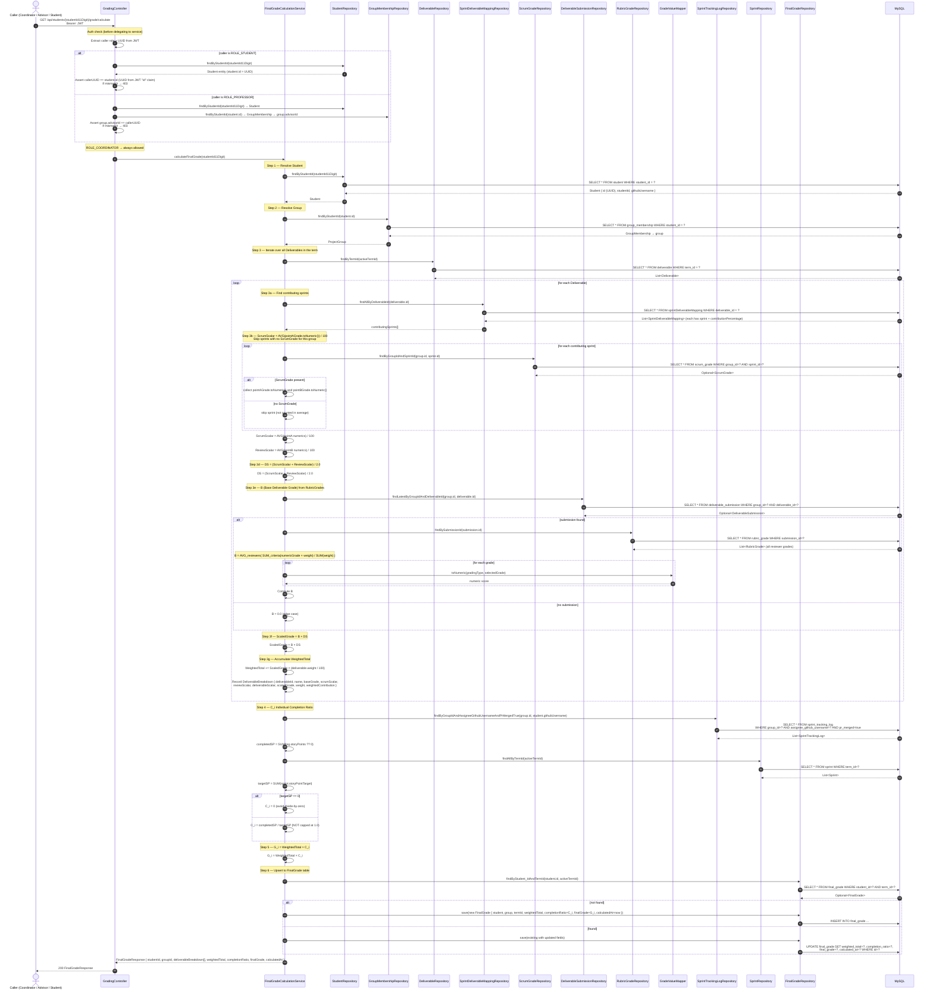
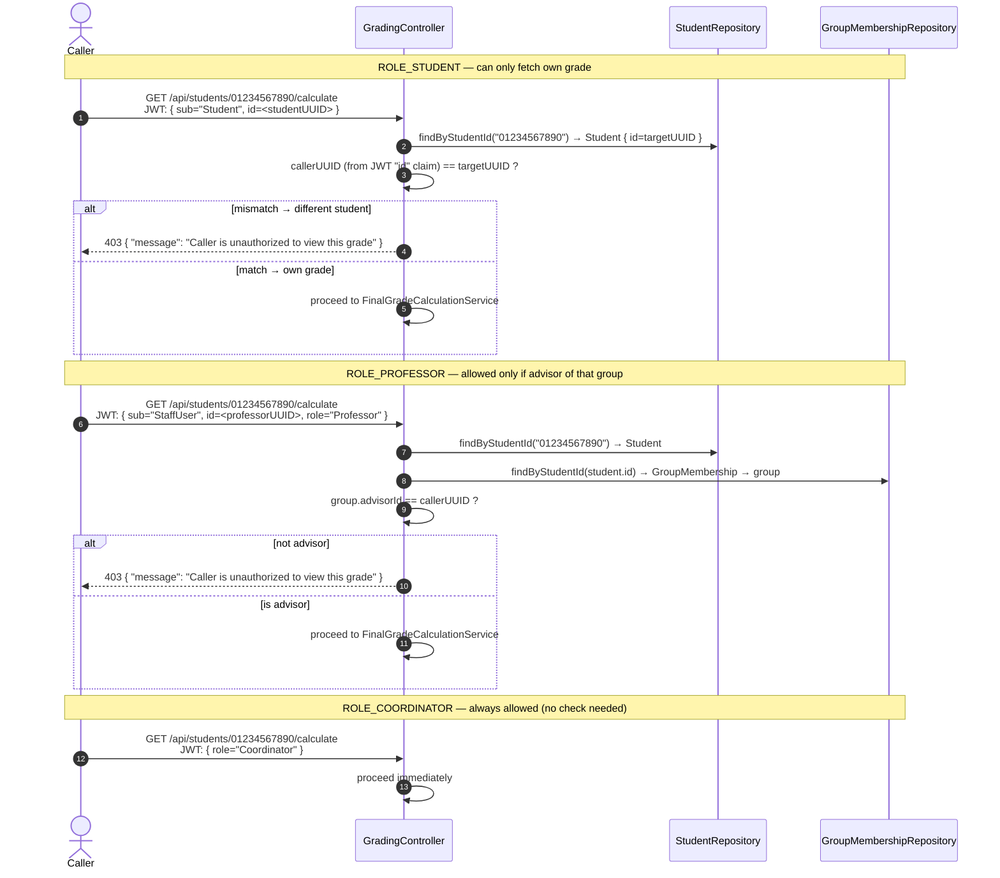

# SD-P7-2 — Final Grade Calculation Engine (Sub-Process 7.2)

**Endpoint:** `GET /api/students/{studentId}/grade/calculate`  
**Path param:** `{studentId}` = **11-digit student number** (not a UUID)  
**Issues:** P7-01 (FinalGrade entity), P7-03 (GradeValueMapper), P7-05 (FinalGradeCalculationService)

---

## Full Calculation Flow



---

## Auth Check Detail



---

## Math Summary

```
For each Deliverable:
  contributingSprints = SprintDeliverableMapping where deliverable_id = D

  ScrumScalar  = AVG(ScrumGrade.pointAGrade.toNumeric() for each sprint with a grade) / 100
  ReviewScalar = AVG(ScrumGrade.pointBGrade.toNumeric() for each sprint with a grade) / 100
  DS           = (ScrumScalar + ReviewScalar) / 2.0

  B            = AVG over reviewers of:
                   SUM(numericGrade(selectedGrade) × criterion.weight) / SUM(criterion.weight)

  ScaledGrade  = B × DS
  WeightedTotal += ScaledGrade × (deliverable.weight / 100)

C_i = SUM(storyPoints where assigneeGithubUsername=student.githubUsername AND prMerged=true)
      / SUM(sprint.storyPointTarget across all term sprints)
      [C_i = 0 if targetSP = 0; NOT capped at 1.0]

G_i = WeightedTotal × C_i
```

---

## Key Classes & Files

| Class | Role | Issue |
|-------|------|-------|
| `GradingController` | REST endpoint; auth dispatch before service call | P7-05 |
| `FinalGradeCalculationService` | Full formula implementation Steps 1–11 | P7-05 |
| `FinalGrade` | JPA entity; upserted at end of calculation | P7-01 |
| `FinalGradeRepository` | `findByStudent_IdAndTermId`, `findByStudent_StudentId` | P7-01 |
| `GradeValueMapper` | `toNumeric(gradingType, value)` used for B computation | P7-03 |
| `ScrumGrade.ScrumGradeValue` | `.toNumeric()` method for scalar computation | P7-03 |
| `DeliverableSubmissionRepository` | Lookup latest submission per group+deliverable | Blue P6 |
| `SprintTrackingLogRepository` | C_i filter: `assigneeGithubUsername` + `prMerged=true` | P5 |

> **D1 (Design decision):** `SprintDeliverableMapping.contributionPercentage` identifies
> which sprints contribute but is NOT used to weight the scalar — plain average is used.
> A `// TODO: consider weighted average` comment must appear in the service.

> **D3 (Design decision):** Endpoint is `GET` per the OpenAPI contract but upserts to
> `FinalGrade` as a documented side effect. A comment in the controller must explain this.
