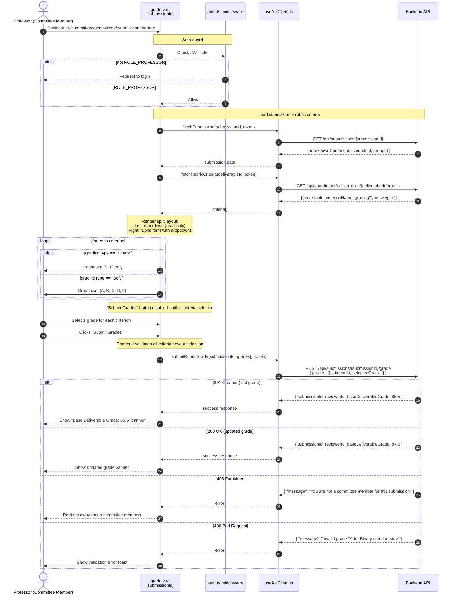
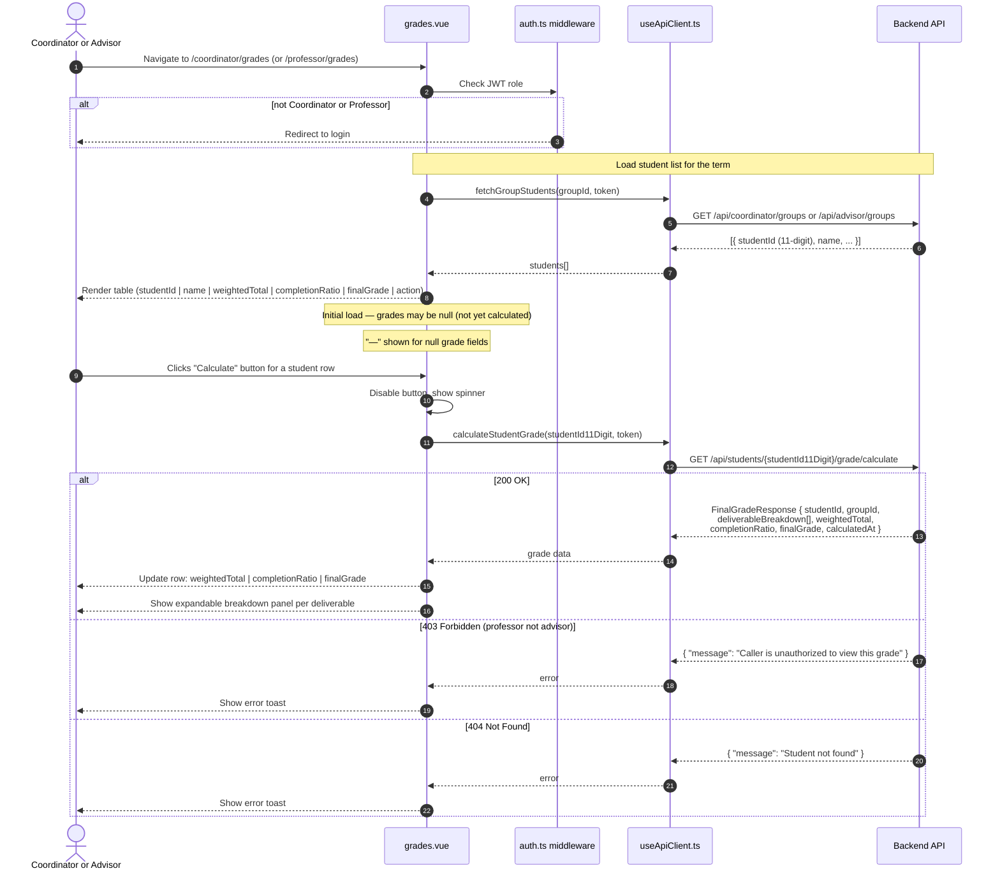
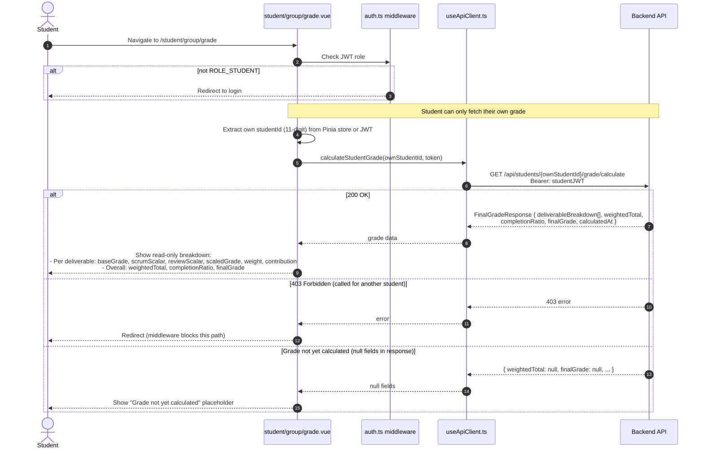

# SD-P7-3 — Frontend Flows (Sub-Processes 7.1 & 7.2)

Covers the two frontend features for P7:
- **P7-06** — Committee Review & Grading Panel (`pages/committee/submissions/[submissionId]/grade.vue`)
- **P7-07** — Final Grade Dashboard (`pages/coordinator/grades.vue`, `pages/student/group/grade.vue`)

---

## P7-06 — Committee Grading Panel

---

## P7-07 — Final Grade Dashboard (Coordinator / Advisor View)

---

## P7-07 — Final Grade Dashboard (Student Self-View)

---

## useApiClient.ts — New Methods for P7

| Method | HTTP | Path | Called by |
|--------|------|------|-----------|
| `submitRubricGrade(submissionId, grades, token)` | POST | `/api/submissions/{submissionId}/grade` | P7-06 grade.vue |
| `calculateStudentGrade(studentId11Digit, token)` | GET | `/api/students/{studentId}/grade/calculate` | P7-07 grades.vue, grade.vue |
| `fetchRubricCriteria(deliverableId, token)` | GET | `/api/coordinator/deliverables/{id}/rubric` | P7-06 grade.vue |

---

## Key UI Rules

| Rule | Where enforced |
|------|----------------|
| Binary criterion dropdown shows **only** `S` / `F` | grade.vue — dropdown options |
| Soft criterion dropdown shows `A`, `B`, `C`, `D`, `F` | grade.vue — dropdown options |
| "Submit Grades" blocked until all criteria have a selection | grade.vue — `:disabled` binding |
| `baseDeliverableGrade` shown on success | grade.vue — success banner |
| Non-committee professors redirected away | auth guard or on-403 redirect |
| Student view is **read-only**; student can only see own data | student/group/grade.vue |
| `studentId` passed to API is the **11-digit number**, not UUID | useApiClient.ts |
| Null grade fields show "—" (before calculation runs) | grades.vue — conditional render |
