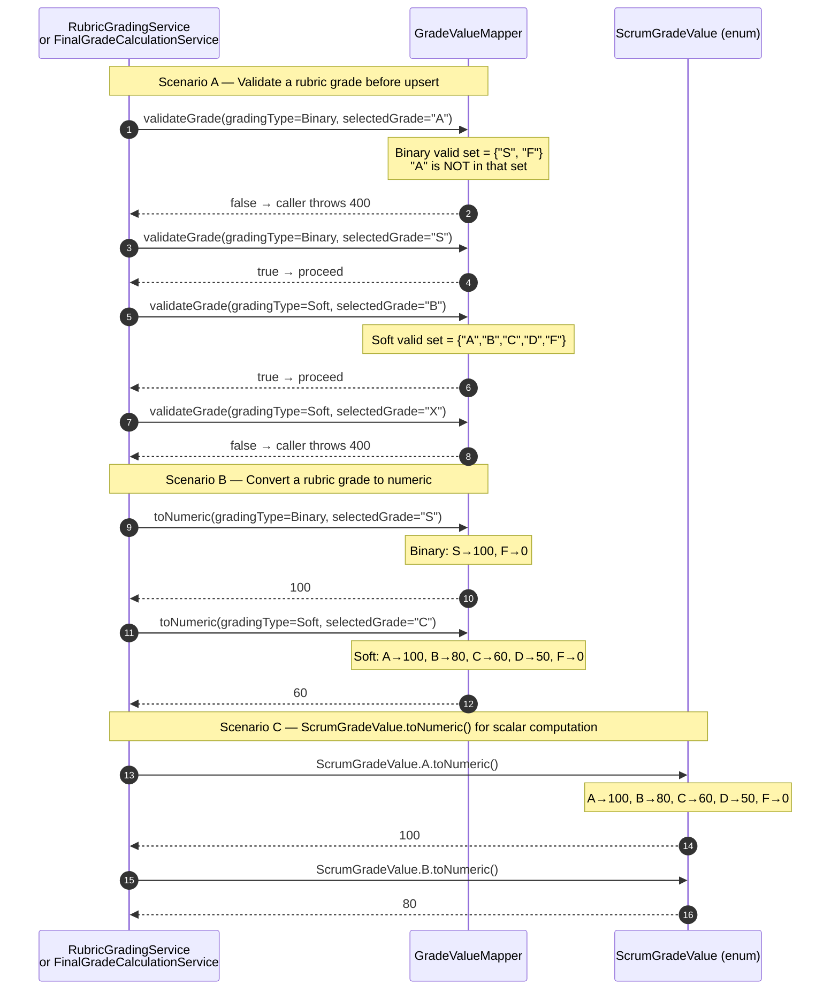

# SD-P7-4 — GradeValueMapper Utility & ScrumGradeValue.toNumeric()

**Issue:** P7-03  
**Files:** `ScrumGrade.java` (MOD), `GradeValueMapper.java` (NEW)

This utility is a pure-logic component with no DB access. It is called by both
`RubricGradingService` (7.1) and `FinalGradeCalculationService` (7.2).

---

## Validation & Conversion Logic



---

## Grade Mapping Table

| Grade | Binary (numeric) | Soft (numeric) | ScrumGradeValue (numeric) |
|-------|-----------------|----------------|--------------------------|
| `S`   | 100             | —              | —                        |
| `A`   | —               | 100            | 100                      |
| `B`   | —               | 80             | 80                       |
| `C`   | —               | 60             | 60                       |
| `D`   | —               | 50             | 50                       |
| `F`   | 0               | 0              | 0                        |

---

## Implementation Sketch

```java
// ScrumGrade.java — add to ScrumGradeValue enum
public enum ScrumGradeValue {
    A, B, C, D, F;

    public int toNumeric() {
        return switch (this) {
            case A -> 100;
            case B -> 80;
            case C -> 60;
            case D -> 50;
            case F -> 0;
        };
    }
}

// GradeValueMapper.java — new static utility
public class GradeValueMapper {

    private static final Set<String> BINARY_VALID = Set.of("S", "F");
    private static final Set<String> SOFT_VALID   = Set.of("A", "B", "C", "D", "F");

    public static boolean validateGrade(RubricCriterion.GradingType type, String value) {
        return switch (type) {
            case Binary -> BINARY_VALID.contains(value);
            case Soft   -> SOFT_VALID.contains(value);
        };
    }

    public static int toNumeric(RubricCriterion.GradingType type, String value) {
        return switch (type) {
            case Binary -> "S".equals(value) ? 100 : 0;
            case Soft   -> switch (value) {
                case "A" -> 100; case "B" -> 80; case "C" -> 60;
                case "D" -> 50;  default   -> 0;
            };
        };
    }
}
```
