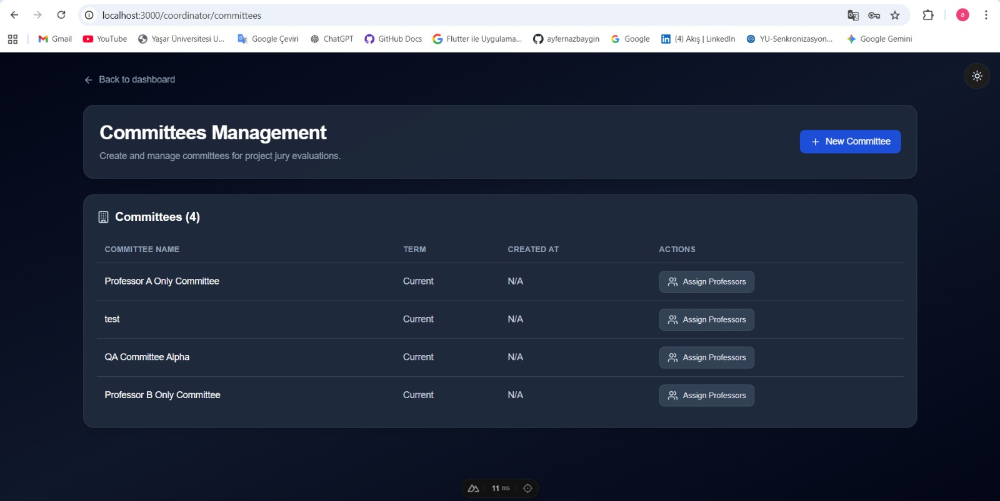
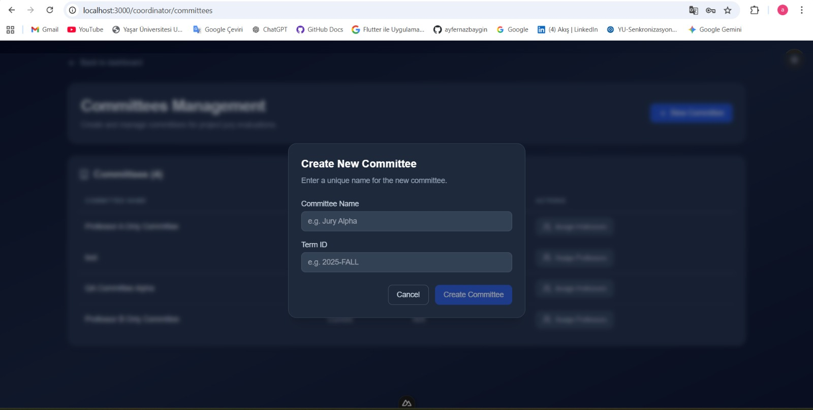
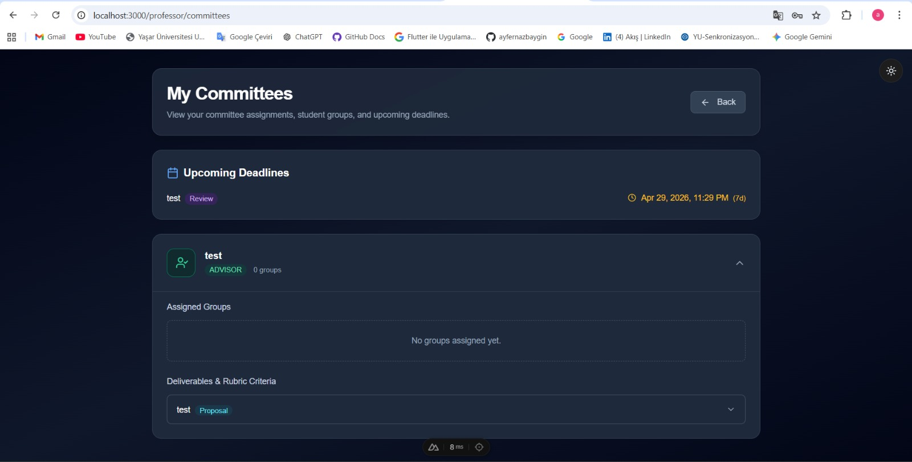
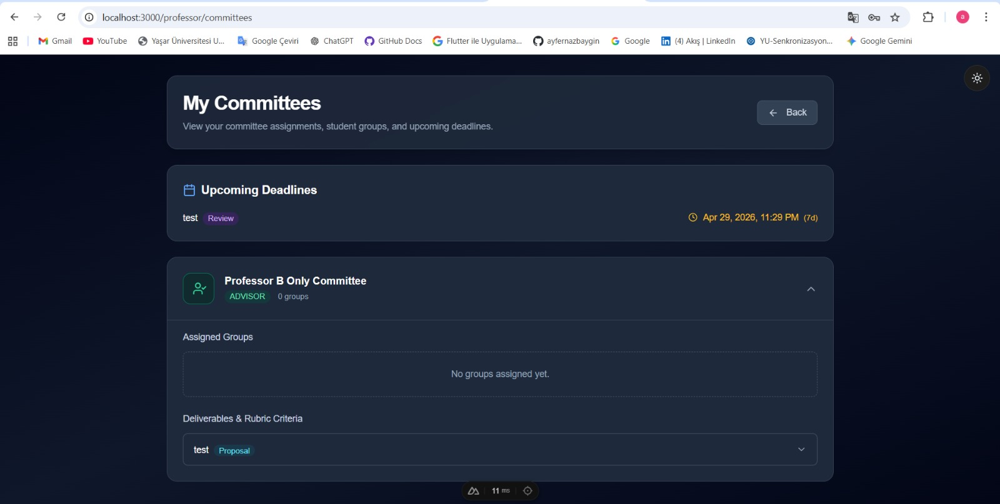

# QA Frontend Manual Test Report

## Environment
- Windows 11
- Google Chrome
- Localhost:3000

---

# Issue 1: Committee Creation UI

## Status
PASSED

## Scope
Verify that committee creation works correctly for Coordinator users and unauthorized users are blocked.

## Test Cases

### Happy Path
- Coordinator opens Committees page successfully.
- "New Committee" button is visible.
- Committee creation modal opens correctly.
- Committee appears in list after creation.

### Empty Form Validation
- Empty submit is blocked.

### UI Refresh
- Table updates without page reload.

## Evidence

### Committees Page

### Create Committee Modal

---

# Issue 2: Professor Data Isolation

## Status
PASSED

## Scope
Verify that professors only see committees assigned to them.

## Test Cases

### Professor A
- Professor A only sees own assigned committee.

### Professor B
- Professor B only sees own assigned committee.

### Isolation
- Cross-visibility does not occur.

## Evidence

### Professor A View

### Professor B View

---

# Final Result

All tested frontend flows work correctly.

Ready for review.