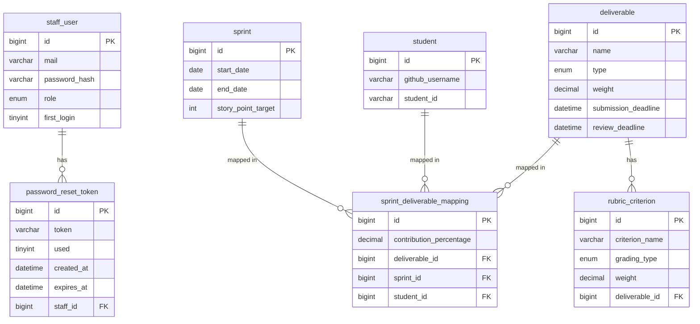
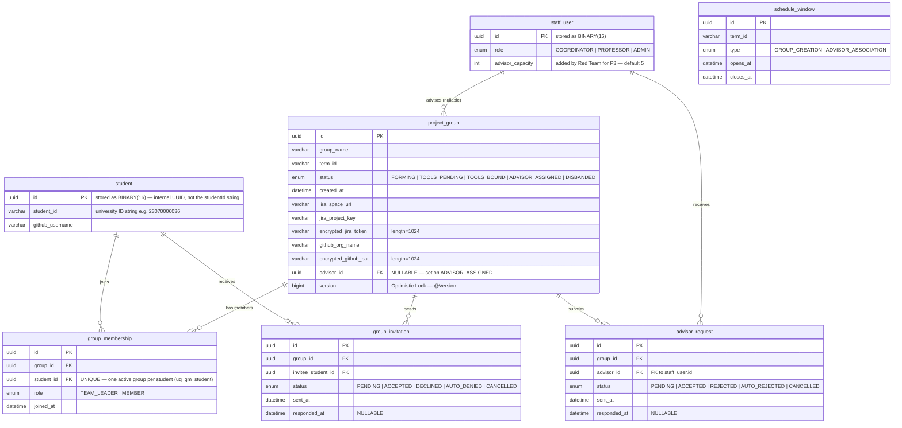
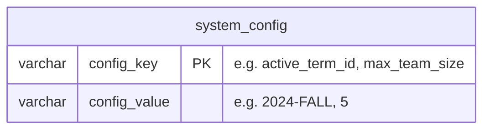

# ER Diagram — P0/P1 (existing) + P2 + P3

---

## Diagram 1 — Existing Tables (Blue Team: P0 / P1)

> **Note:** Diagram 1 is preserved for context only. Blue Team PKs are actually UUID (BINARY(16)), not bigint — see Diagram 2 for the corrected representation used by Red Team.

---

## Diagram 2 — New Tables (P2: Group Creation + P3: Advisor Association)

> `staff_user` and `student` are carried over from P0/P1 (shown here as anchors only).

---

## Diagram 3 — Shared Config Table (owned by Red Team)

> Red Team creates and seeds this table. Blue Team adds their own config keys as rows — no separate table needed.

---

## Notes

| Entity | Process | Key constraint |
|---|---|---|
| `schedule_window` | P2 + P3 | No FK to term table — `term_id` string stamped by backend via `TermConfigService` |
| `group_membership` | P2 | TWO unique constraints: `uq_gm_group_student (groupId, studentId)` + `uq_gm_student (studentId)` |
| `group_invitation` | P2 | One PENDING per student per group — service-layer 409 |
| `advisor_request` | P3 | One active PENDING per group — service-layer 409 |
| `project_group.advisor_id` | P3 | NULLABLE FK to `staff_user`; set on `ADVISOR_ASSIGNED` only |
| `project_group.version` | P3 | `@Version` Optimistic Lock — prevents sanitization race condition |
| `staff_user.advisor_capacity` | P3 | Column added to existing table; default 5; enforced at service layer |
| `system_config` | P2+P3 | **Red Team table** — seeded with `active_term_id` and `max_team_size`; Blue Team adds their own rows |
